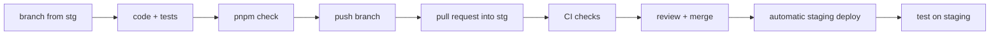

# Onboarding: from a new laptop to your first staging deploy

This guide is for a developer joining the Switch team. Follow it from top to bottom. By the end
you will have:

1. every tool installed,
2. the code on your machine,
3. the whole platform (server, apps and dashboards) running locally with test data,
4. a change of your own tested, reviewed and deployed to staging.

It assumes a Mac. The commands are written for the default macOS terminal (zsh).

---

## 1. What you are working on

Switch is a food delivery platform. It is made of one backend and six clients:

| Repository | What it is | Tech |
|---|---|---|
| `switch-server-v2` | The backend (this repository). | Parse Server 9, Node 24, TypeScript |
| `switch-food` | Customer app. | React Native |
| `switch-driver` | Driver app. | React Native |
| `switch-manager` | Restaurant manager app. | React Native |
| `switch-dashboard` | Admin dashboard. | React, Vite |
| `switch-ops` | Operations console (orders board, dispatch, support). | Next.js |
| `switch-finance` | Finance dashboard (commissions, invoices). | Next.js |
| `switch-admin` | Admin console (regions, promo codes, banners, push campaigns, team, app settings). | Next.js |
| `switch-server` | The **old** backend, still running production. | Parse Server 4.3, Node 14 |

All clients talk to the backend through the Parse SDK. The backend keeps its data in MongoDB,
stores files in an S3 bucket (DigitalOcean Spaces), sends pushes with Firebase, realtime events
with Pusher, SMS with SMS Algérie and email with SendGrid.

There are three places the backend runs:

| Where | Used for | Data |
|---|---|---|
| **Local** (your laptop) | Everyday development. | Fake test data in Docker. Push, SMS and email are fakes printed in the log. |
| **Staging** (`https://switchfood-staging.oa.r.appspot.com`) | Testing on the internet, on real phones. | Its own database with test data. |
| **Production** (`api.switchfood.net`) | Real customers. | Real data. Still served by the old `switch-server`. |

### The rules

- **Never test against production.** No test accounts, orders, pushes or API calls against
  `api.switchfood.net`, and never point a client at it to "just try something". Use local or
  staging. The server helps: outside production it refuses to start if its config contains a
  production value.
- **Don't change how the server answers.** The apps in people's phones rely on the exact
  responses of the old server, including odd error messages. If a change alters a response,
  it must be discussed first and listed in the
  [Deviation Register](01-rewrite-plan.md#9-deviation-register).
- **New server work goes into `switch-server-v2`.** The old `switch-server` is not changed.
- **Never commit a secret** (passwords, API keys, service account files). Secrets live in Google
  Secret Manager. CI scans every change and fails if it finds one.

---

## 2. Ask for access

Ask the project owner for these before you start. You can install the tools (step 3) while you
wait.

| Access | Why you need it | Needed for |
|---|---|---|
| GitHub: collaborator on the `switchdevv` repositories | Clone, push branches, open pull requests. | Everything |
| Google Cloud: a role on the `switchfood-staging` project | Read staging logs, roll back, change staging secrets. | Section 7 only |

You don't need access to MongoDB Atlas, Firebase, Pusher, DigitalOcean or production to develop.

> **For the project owner.** GitHub: each repository → Settings → Collaborators → Add people.
> Google Cloud, with the new developer's Google account:
>
> ```bash
> for role in roles/logging.viewer roles/appengine.appAdmin roles/secretmanager.admin; do
>   gcloud projects add-iam-policy-binding switchfood-staging --condition=None \
>     --member="user:NEW_DEV@gmail.com" --role="$role"
> done
> ```
>
> `logging.viewer` reads logs, `appengine.appAdmin` allows rollbacks, `secretmanager.admin`
> allows changing staging secrets. Give only `logging.viewer` if they won't do those.

---

## 3. Install the tools

### 3.1 Homebrew and the command-line tools

[Homebrew](https://brew.sh) installs everything else. If `brew --version` fails, install it
with the command on brew.sh, then:

```bash
brew install git gh nvm
brew install --cask docker google-cloud-sdk
```

- **Docker Desktop**: open it once from Applications and let it finish starting (the whale icon
  in the menu bar stops moving). It must be running whenever you work locally.
- **nvm** needs two lines in your shell profile. Run `brew info nvm` and copy the lines it shows
  into `~/.zshrc`, then open a new terminal.

### 3.2 Node 24 and pnpm

Every repository has a `.nvmrc` file with `24` in it.

```bash
nvm install 24
nvm alias default 24
node --version        # v24.x
corepack enable       # makes the right pnpm version available
pnpm --version        # 11.9.0 (read from package.json the first time)
```

The server uses **pnpm**. The clients use **npm** (it comes with Node).

### 3.3 GitHub

```bash
gh auth login         # choose GitHub.com, SSH, and let it create/upload an SSH key
ssh -T git@github.com # "Hi <you>! You've successfully authenticated"
git config --global user.name "Your Name"
git config --global user.email "you@example.com"
```

### 3.4 Google Cloud CLI

Only needed for section 7 (staging), but it is quicker to set up now:

```bash
gcloud auth login                               # opens the browser
gcloud config set project switchfood-staging
```

### 3.5 For the phone apps (optional)

Only if you will work on switch-food, switch-driver or switch-manager:

- **Android**: install [Android Studio](https://developer.android.com/studio). In its SDK
  Manager, install an Android SDK and create an emulator (Device Manager → Create device).
  Install a JDK: `brew install --cask zulu@17`. Add to `~/.zshrc`:

  ```bash
  export ANDROID_HOME="$HOME/Library/Android/sdk"
  export PATH="$PATH:$ANDROID_HOME/platform-tools:$ANDROID_HOME/emulator"
  ```

  Check with `adb --version` in a new terminal.
- **iOS**: install Xcode from the App Store, open it once to accept the license, and install an
  iOS simulator (Xcode → Settings → Components). Then `brew install cocoapods`.

The React Native [environment setup guide](https://reactnative.dev/docs/set-up-your-environment)
explains each step in more detail if something doesn't work.

---

## 4. Get the code

All repositories must sit **side by side in the same folder**, with these exact names. The
server's `pnpm dev:all` finds the clients by looking next to itself.

```bash
mkdir -p ~/dev/switch-food && cd ~/dev/switch-food
for repo in switch-server-v2 switch-food switch-driver switch-manager switch-dashboard \
  switch-ops switch-finance switch-admin; do
  git clone "git@github.com:switchdevv/$repo.git"
done
```

You should now have:

```
~/dev/switch-food/
  switch-server-v2/
  switch-food/
  switch-driver/
  switch-manager/
  switch-dashboard/
  switch-ops/
  switch-finance/
  switch-admin/
```

Install the dependencies:

```bash
cd ~/dev/switch-food/switch-server-v2
pnpm install

for app in switch-food switch-driver switch-manager switch-dashboard switch-ops switch-finance switch-admin; do
  (cd "../$app" && npm install)
done
```

For iOS only, also run `npx pod-install` inside each phone app folder.

### Branches

| Branch | Meaning |
|---|---|
| `stg` | What runs on staging. **Every push to `stg` deploys to staging.** Start your work from here. |
| `main` | Kept for the future production pipeline. Nothing deploys from it today. |

---

## 5. Run everything locally

### 5.1 First time only

```bash
cd ~/dev/switch-food/switch-server-v2
pnpm setup:env
```

This creates `.env.local`: the local server's settings, with random keys that only work on your
machine. It is never committed. You don't need any real secret to run locally.

### 5.2 Start

Make sure Docker Desktop is running, then:

```bash
pnpm dev:all
```

It starts, in this order:

1. **MongoDB and a local S3** in Docker (ports 27018 and 9000). Data is kept between runs.
2. **The server** on http://localhost:1337. It restarts when you save a file.
3. **The seed**, only if the database is empty: cities, restaurants with menus, managers,
   drivers, customers, a promo and 65 orders.
4. **The dashboards**: finance on http://localhost:3000, dashboard on http://localhost:3010,
   ops on http://localhost:3020, admin on http://localhost:3030.
5. **Metro** for the phone apps: food on 8081, driver on 8082, manager on 8083.

All logs appear in the same terminal, each line prefixed with its source. Check it works:

```bash
curl http://localhost:1337/health     # {"status":"ok"}
```

Useful variations:

```bash
pnpm dev:all --only ops              # the server and switch-ops only
pnpm dev:all --only ops,food         # the server, switch-ops and switch-food
pnpm dev:all --skip mobile           # no Metro (web dashboards only)
```

**Ctrl-C** stops everything except Docker. `pnpm stack:down` stops Docker too.

### 5.3 Log in

Every test account uses the password **`switch-dev`**. Log in with the username:

| Username | Who | Use in |
|---|---|---|
| `admin` | Admin | dashboard, ops, finance, admin |
| `ops` | Ops staff | dashboard, ops, finance |
| `manager.roma`, `manager.burger`, `manager.couscous` | Restaurant managers | switch-manager |
| `driver.amine`, `driver.sara`, `driver.yacine` | Drivers, online near Pizza Roma | switch-driver |
| `customer` | Customer in Alger with a saved address | switch-food |

The full list and what the seed creates are in [04-local-dev.md](04-local-dev.md).

### 5.4 The phone apps

With `pnpm dev:all` running, open a second terminal and install an app on your emulator once:

```bash
cd ~/dev/switch-food/switch-driver
npm run android:local       # or: npm run ios:local
```

Always use the **`:local`** scripts. They point the app at your local server and use their own
Metro port, so the three apps can run side by side. The normal `npm run android` points at
production: don't use it for testing.

Set the emulator's location inside Alger (around 36.75, 3.06) or Oran (around 35.70, -0.63):
the apps pick the city from your position.

### 5.5 What is fake locally

- **SMS codes, emails and pushes** are not sent. The server log prints each one, including OTP
  codes and email links. Look there when an app waits for a code.
- **Distances** are always 3.2 km.
- **Google and Apple sign-in** need real accounts. Use username and password instead.

### 5.6 Start again from clean data

```bash
pnpm db:reset      # empties the local database and seeds it again
```

---

## 6. Make a change and ship it to staging

### 6.1 The flow



### 6.2 Step by step

**1. Start from an up-to-date `stg`:**

```bash
cd ~/dev/switch-food/switch-server-v2
git switch stg
git pull
git switch -c fix/short-description      # or feat/..., chore/...
```

**2. Write the code and its tests.** Tests live in `test/`:

- `test/unit/`: pure logic, no server.
- `test/integration/`: a real Parse Server and an in-memory MongoDB, with fake outside
  services. Most server behaviour is tested here. Look at a neighbouring test file and copy its
  shape.

Run tests while you work:

```bash
pnpm test                                        # everything (about 10 seconds)
pnpm exec vitest run test/integration/orders.test.ts   # one file
pnpm exec vitest test/integration/orders.test.ts       # one file, re-runs on save
```

The first run downloads a MongoDB binary for the in-memory database, so it takes longer once.

**3. Try it for real.** With `pnpm dev:all` running, use the apps or dashboards against your
local server.

**4. Check everything CI will check:**

```bash
pnpm check           # typecheck + lint + tests
pnpm format          # fixes formatting
pnpm build           # makes sure it compiles for deploy
```

**5. Commit.** Messages start with a type: `feat:` (new feature), `fix:` (bug fix), `chore:`
(tooling, dependencies), `docs:`. Keep the first line short and say what changed:

```bash
git add -A
git status           # check: no .env.local, no secret files, nothing you didn't mean to add
git commit -m "fix: refuse a promo code after its expiration date"
```

**6. Push and open a pull request into `stg`:**

```bash
git push -u origin fix/short-description
gh pr create --base stg --fill
```

CI runs on the pull request (typecheck, lint, format, tests, build, dependency audit, secret
scan). Follow it with `gh pr checks --watch`. Fix anything red and push again.

**7. Merge.** After review, merge the pull request (squash merge is fine):

```bash
gh pr merge --squash --delete-branch
```

Don't push directly to `stg`: it deploys right away, without review.

**8. Watch the deploy.** Merging into `stg` starts the `deploy-staging` workflow:

```bash
gh run watch
```

It runs all the checks again, uploads the new version to App Engine **without traffic**, checks
that it answers `/health` and `/config`, and only then sends all traffic to it. If the new
version doesn't start, staging keeps the previous version and the run fails with the command to
read the logs. A deploy takes 3 to 10 minutes. The run's summary page shows the version name and
the rollback command.

**9. Check on staging:**

```bash
curl https://switchfood-staging.oa.r.appspot.com/health    # {"status":"ok"}
```

Then test your change through a client pointed at staging.

### 6.3 Changes that touch the clients

A change to a client (for example switch-ops) happens in that client's own repository, with its
own branches and pull requests. If a feature needs both a server change and a client change,
ship the server change to staging first, then the client.

---

## 7. Working with staging

You need the Google Cloud access from section 2 and `gcloud` set up (section 3.4).

### 7.1 Logs

```bash
gcloud app logs tail --service=default --project=switchfood-staging
```

Or in the browser: Google Cloud console → project `switchfood-staging` → Logging → Logs
Explorer.

### 7.2 Redeploy without a code change

```bash
gh workflow run deploy-staging --ref stg
```

### 7.3 Roll back to a previous version

```bash
gcloud app versions list --service=default --project=switchfood-staging
gcloud app services set-traffic default --splits=<version>=1 --project=switchfood-staging
```

The five previous versions are kept. The next push to `stg` deploys over the rollback, so fix
the problem on `stg` soon after.

### 7.4 Settings and secrets

Staging reads its settings from two places:

| Where | What | How to change it |
|---|---|---|
| `.env.staging` (committed) | Everything that is not secret: URLs, allowlists, drivers, the pinned secret version. | Edit, commit, pull request into `stg`. |
| Secret Manager, secret `switch-server-staging-env` | Passwords and keys: database URI, master key, API keys. | `pnpm staging:secret` (below). |

The server reads the secret version pinned by `SECRETS_VERSION` in `.env.staging`. Changing a
secret is therefore two steps: add a new version, then deploy the new pin.

```bash
cd ~/dev/switch-food/switch-server-v2
git switch stg && git pull && git switch -c chore/rotate-sms-key
pnpm staging:secret
```

It asks for each value, hidden as you type. **Press Enter to keep the current value.** Before
saving, it runs the server's own start-up checks on the result and shows a summary without the
values. When you answer `y`, it adds the new version and updates `SECRETS_VERSION` in
`.env.staging`. Then commit `.env.staging` and open a pull request into `stg` as in section 6.
The older versions stay available, so a rollback keeps working.

To create new master and maintenance keys: `pnpm staging:secret --new-keys`.

**Test phones and emails.** Staging shares the production SMS and email accounts, but only sends
to addresses listed in `.env.staging`:

- `SMS_PHONE_ALLOWLIST`: phone numbers written as the apps send them (`+213555123456`),
  comma-separated, no spaces.
- `MAIL_ALLOWLIST`: email addresses, comma-separated.

Anyone else gets nothing (the message is only logged). To test with your own phone, add your
number and deploy.

### 7.5 Testing phone apps on staging

Pushes from staging only reach app builds made with the staging Firebase project. Builds pointed
at staging are not set up in the app repositories yet; ask before changing an app's server URL,
and never commit a change that points a release build at staging.

### 7.6 The staging database

Staging has its own MongoDB (Atlas) with seeded test accounts. Ask the team for the staging
password of the test accounts (`admin`, `ops`, `driver.sara`, `customer`, …). It is not
`switch-dev`.

---

## 8. When something goes wrong

| Problem | What to do |
|---|---|
| `pnpm: command not found` | `corepack enable`, then open a new terminal. |
| `node` is not version 24 | `nvm use` inside the repository, or `nvm alias default 24`. |
| `dev:all` says a port is taken | Another process uses it. `lsof -i :1337` (or the port it names) shows which one. |
| Docker errors / MongoDB timeouts | Docker Desktop is not running. Start it and wait until it is ready. |
| Server refuses to start: `Invalid environment` | `.env.local` is missing a value or is old. Compare with `.env.example`, or delete `.env.local` and run `pnpm setup:env` again. |
| Server refuses to start: `Refusing to boot` | A setting points at production. The message names it. Remove it. |
| A phone app shows production data | It was installed with `npm run android`/`ios`. Reinstall with `npm run android:local`/`ios:local`. |
| An app waits for an SMS code | Locally, the code is printed in the server log. On staging, your number must be in `SMS_PHONE_ALLOWLIST`. |
| CI fails on formatting | `pnpm format`, commit, push. |
| CI fails on gitleaks | A secret was committed. Tell the project owner right away: the secret must be changed, not just deleted from the branch. |
| Staging deploy failed | Open the run (`gh run view --web`). The failing step prints what to do; staging still serves the previous version. More cases in [05-staging.md](05-staging.md#troubleshooting). |

---

## 9. Read next

- [Local development](04-local-dev.md): every local detail and all seeded accounts.
- [Contract inventory](02-contract-inventory.md): every function and response the apps depend on.
  Read the part about the area you are changing before you change it.
- [Environments](03-environments-and-dev-setup.md): every setting and what it does.
- [Staging](05-staging.md): how staging was built, if it ever needs to be rebuilt.
- [Rewrite plan](01-rewrite-plan.md): why v2 exists and what is left to do before production.
