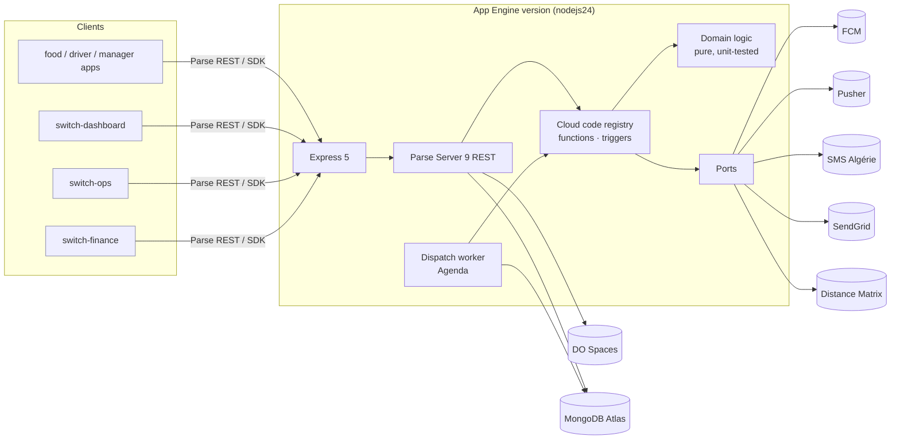

# switch-server v2 — Rewrite Plan

| | |
|---|---|
| **Status** | Draft for review. No code written yet. |
| **Date** | 2026-09-21 |
| **Scope** | Replace `switch-server` (Parse Server 4.3.0, Node 14, JavaScript) with `switch-server-v2` (Parse Server 9.x, Node 24, TypeScript, pnpm). Same Parse app, same MongoDB, same public URL. |
| **Companion docs** | [02-contract-inventory.md](02-contract-inventory.md) is the exact list of what must not change. [03-environments-and-dev-setup.md](03-environments-and-dev-setup.md) covers `.env.*`, secrets, the local stack and staging. |

---

## 0. Summary

- **What.** Port every cloud function (50), trigger (11) and background job (1) of the legacy
  server to strict TypeScript on current libraries. The server keeps the same wire protocol, so
  none of the six clients changes: switch-food, -driver and -manager (including old store builds
  still on phones), switch-dashboard (Parse SDK 2.x), switch-ops and switch-finance.
- **Why now.** (1) Prod runs on App Engine `nodejs14`, which Google **deprecated on 2025-01-31**.
  Past end of support, Google's lifecycle page says you *"will no longer be able to create and/or
  update the application on the unsupported runtime."* Unless P0-1 shows otherwise, **the current
  server can't be redeployed: no hotfix is possible today.** (2) Every production secret is committed
  in `configs.js`. (3) MongoDB driver 3.5.9 (2020), no tests, no types, no lint, and `npm start`
  on a laptop joins production dispatch.
- **How nothing breaks.** Parity first, improvements later. We record what legacy actually does,
  in a Docker harness with every outside service faked. Then we run the **same** scenarios against
  v2 and diff the responses, the database state and the outbound side effects. Any difference
  fails the build unless it is listed in the Deviation Register (§9). After that come an isolated
  staging environment, a rehearsal on a restored *copy* of prod data, and a gradual App Engine
  traffic split with a one-command rollback to the untouched legacy version.
- **What we never do.** Test against production. That means no test orders, accounts, pushes or
  cloud-function calls against `api.switchfood.net`, and no local process (legacy or v2) pointed at
  the production database or third-party accounts. v2 enforces this in code (§3.5).
- **Effort.** About 8–10 weeks for one senior engineer (§8). Most of it is the characterization
  and parity suites, which is where "nothing breaks" is earned.

---

## 1. Ground rules

| # | Rule | How it's enforced |
|---|---|---|
| R1 | **Wire compatibility.** Function names, param names and truthiness rules, response shapes, error `code` + message strings, trigger side effects, push/Pusher/SMS/email payloads, file URLs, and document shapes in MongoDB are all unchanged. | Contract inventory + differential parity suite (§7) gating every PR. |
| R2 | **No testing in production.** Production is only touched by the final deploy and traffic moves. Prod checks are passive: dashboards, logs, `/health`. | Env guard refuses to boot `local`/`test`/`staging`/`rehearsal` with any production value (§3.5). Runbook (§10) contains no prod test calls. |
| R3 | **Parity before improvement.** The cutover release fixes nothing, including known bugs ([inventory §8](02-contract-inventory.md#8-legacy-quirks-that-are-part-of-the-contract-port-them-as-is-fix-later-one-by-one)). Every fix ships afterwards as its own release with its own client-impact review. | Deviation Register (§9) is the only allowed list of differences. |
| R4 | **The server never changes schema, CLPs or Config at boot.** These belong to the Parse Dashboard (you). | No `schema` option. `allowClientClassCreation: false`. Index creation reviewed in rehearsal (§6.2). |
| R5 | **Every step is reversible.** Legacy stays deployed and untouched until 30 days after 100% cutover. | Traffic split rollback (§10). |
| R6 | **No secret in git.** Ever. | Secrets live in Secret Manager. `gitleaks` in CI and pre-commit. The v2 repo starts with fresh history (legacy history contains secrets). |
| R7 | **Boring, explicit configuration.** Every Parse Server option whose default changed since 4.3 is set explicitly, with a comment saying why. | `src/config/parse-options.ts` + unit test that snapshots the resolved options. |

---

## 2. Baseline: legacy facts (verified in the repo)

| Area | Fact |
|---|---|
| Code | `switch-server` @ `5b6927c`, ~2.5k lines of JS: 25 files under `cloud/` + `translations.json`, plus `index.js`, `dashboard.js`, `configs.js`. No tests, no linter, no types. |
| Runtime | App Engine standard, `runtime: nodejs14`, `instance_class: F1` (384 MB on current App Engine), `min_instances: 1`, `max_instances: 5`. |
| Parse | `parse-server` **4.3.0** (lockfile), embedded JS SDK **2.15.0**, mounted at `/`, `serverURL = publicServerURL = https://api.switchfood.net`, `directAccess` off (cloud-code SDK calls go out over the internet and back). |
| Libraries (lockfile) | express 4.17.1, mongodb 3.5.9 (Agenda: 3.6.6), agenda 4.1.3, firebase-admin 9.3.0, pusher 5.0.0, stripe 8.122.1 (**no pinned API version**, so it uses the account default), `@parse/s3-files-adapter` 1.4.0 (bundled), parse-server-sendgrid-adapter 1.0.0 (SendGrid **v2** `mail.send.json`), google-distance-matrix 1.1.1. |
| Undeclared deps | `node-fetch` (SMS) and `request` (file delete) are only present transitively. |
| Unused deps | `twilio`. `aws-sdk` v2 is only used for `new AWS.Endpoint(...)`. `parse-dashboard` is a runtime dependency but only used by `dashboard.js`. |
| Secrets | `configs.js` holds the master key, DB URI, Firebase service account private key, Stripe secret, SendGrid key, SMS keys, Spaces keys, Pusher secret and Maps key, all committed. |
| Background work | Agenda worker starts on `require` in **every instance** and polls `agendaJobs` every 5 s. |
| Local dev | None safe. The earlier `local/sandbox.js` launcher is **gone** (`.git/info/exclude` still lists `local/`, and `.claude/launch.json` still points to it). |
| Schema snapshot | `_SCHEMA.json` is from 2023 and out of date (no `DispatchQueue`, no ops/finance access columns). |

Clients (read 2026-09-21): food/driver/manager `parse ^8.6.0` + RN 0.81.6 (old builds in the field
run older SDKs); dashboard `parse ^2.17.0`; ops and finance `parse ^8.6.0` (Next 16).

---

## 3. Target state

### 3.1 Versions

Latest stable on the npm registry, checked **2026-09-21**. Pin exact versions (`save-exact`) and
upgrade through Renovate.

| Concern | Choice | Why / constraint |
|---|---|---|
| Runtime | **Node.js 24 LTS**, ≥ 24.11.0 | parse-server 9.10 requires `>=24.11.0 <25` on the 24 line. App Engine `nodejs24` is supported until 2028-04-30. firebase-admin 14 needs Node ≥ 22. |
| Package manager | **pnpm**, pinned via `packageManager` + `engines.pnpm` | App Engine buildpacks pick pnpm when `pnpm-lock.yaml` exists and read the version from `engines.pnpm`. Current major is 12.x (12.5.1). **P1-9 verifies the buildpack accepts it**; fall back to the newest version it accepts (e.g. 10.34.5). |
| Language | **TypeScript 6.0.x** (6.0.3), `strict` | **Not 7.x.** typescript-eslint 8.70 declares `typescript >=4.8.4 <6.1.0`. Move to 7 once typescript-eslint supports it. |
| Module system | ESM (`"type": "module"`), `module: nodenext` | Agenda 6 is ESM-only. |
| Parse Server | **parse-server 9.10.0** | Needs MongoDB ≥ **7.0.16** and Node ≥ 20.19. Uses Express 5.2.1, MongoDB driver 7.1.0 and JS SDK 8.6.0 internally. |
| Parse SDK (types + cloud code) | `parse` 8.6.0 | Same version parse-server 9.10 embeds. Also the version ops/finance/RN apps use. |
| HTTP | express 5.2.1 | Same major as Parse Server 9 (Express 5 since Parse 8.0). |
| Jobs | agenda 6.2.6 + `@agendajs/mongo-backend` 4.0.3, **gated by spike S-3** | v6 is a TypeScript rewrite with a pluggable backend. Compatibility with legacy v4 job documents must be proven (§6.6). |
| Push | firebase-admin 14.4.0 | `messaging().send()` uses FCM HTTP v1, the same API 9.3.0's `send()` uses. |
| Realtime | pusher 5.3.4 | Same major as legacy (5.0.0). |
| Files | `@parse/s3-files-adapter` 5.3.1 (AWS SDK v3) | Split out of parse-server in 5.0. Options differ from 1.4.0 (§6.4). |
| Email | `@sendgrid/mail` 8.1.6 behind a ~30-line Parse email adapter | Replaces the 2016 adapter that uses SendGrid's legacy v2 API. |
| Payments | **none**: Stripe removed | Card payments are unused and legacy's Stripe key is blank (§6.7, D-12). |
| Distance, SMS | native `fetch` | Drops `google-distance-matrix` (unmaintained), `node-fetch` and `request`. |
| Config validation | zod 4.6.5 | Env schema, typed config. |
| Secrets | `@google-cloud/secret-manager` 7.1.0 | Staging and prod only. |
| Logging | pino 10.3.1 + pino-http 11.0.0 | JSON on stdout → Cloud Logging, with trace correlation. |
| Tests | vitest 5.0.1, mongodb-memory-server 11.2.0 (unit/integration), Docker Mongo for parity, supertest 7.2.2, msw 2.15.0 (outbound HTTP) | |
| Lint/format | eslint 10.11 + typescript-eslint 8.70, prettier 3.9.8, gitleaks | |
| Removed | stripe, twilio, aws-sdk v2, request, node-fetch, google-distance-matrix, parse-server-sendgrid-adapter, parse-dashboard (moves to a Docker Compose service) | |

### 3.2 Hosting (unchanged topology)

Same GCP project `switch-proj`, same App Engine service, same custom domain. v2 deploys as a
**new version** of the service (`runtime: nodejs24`), so the cutover is a traffic move and rollback
is a traffic move back (§10). Instance class **F2 (768 MB)** is the starting point. Parse Server 9
on Node 24 has a larger baseline footprint than 4.3 on Node 14. Staging load tests (P4-5) confirm
or adjust this before prod (OD-8).

### 3.3 Architecture



Principles:

- **Parse Server stays the framework** (ADR-1). Every client speaks Parse REST and the Parse SDK.
  Swapping to NestJS or anything else would break all of them.
- **Ports & adapters for every side effect** (ADR-4). `PushPort`, `RealtimePort`, `SmsPort`,
  `MailPort`, `DistancePort`, `FileStorePort`, `SchedulerPort`, `Clock`, `Random`.
  Real adapters are used in staging/prod, recording fakes in local/test, and allowlist wrappers in
  staging. This is what makes "never touch prod from a laptop" structural rather than a habit.
- **Cloud code is a thin shell.** Each function is `guard → legacy param check → domain call →
  side effects`, one file per function. Business rules (fee tiers, rating maths, dispatch radius,
  new-user defaults, i18n titles) live in `src/domain` as pure functions.
- **One registry.** `src/cloud/index.ts` registers every function and trigger from a single typed
  table. A unit test asserts the table equals the 50 + 11 names in the inventory. Nothing can be
  added or dropped silently.
- **Cloud code gets `Parse` by injection.** Parse 9 calls `cloud(Parse)` when `cloud` is a
  function. No reliance on the global.

### 3.4 Repository layout

```
switch-server-v2/
├─ package.json            # "type":"module", engines.node 24.x, engines.pnpm, packageManager
├─ pnpm-lock.yaml
├─ tsconfig.json / tsconfig.build.json
├─ eslint.config.js  .prettierrc  .editorconfig  .nvmrc (24)
├─ app.yaml                # prod:    runtime nodejs24, APP_ENV=production
├─ app.staging.yaml        # staging: separate project/service (OD-1)
├─ .gcloudignore           # uploads dist/, package.json, pnpm-lock.yaml, .env.prod|.env.staging only
├─ docker-compose.yml      # mongo (replica set), s3 (SeaweedFS), legacy (profile)
├─ .env.example            # every variable, documented, no secrets        (committed)
├─ .env.test               # fake values for the test suite                (committed)
├─ .env.staging / .env.prod# NON-secret config only                        (committed)
├─ .env.local              # generated by `pnpm setup`                     (gitignored)
├─ src/
│  ├─ main.ts              # process entry: load env → secrets → start → graceful shutdown
│  ├─ app.ts               # createApp(config): Express + ParseServer (testable factory)
│  ├─ config/              # env.ts (zod), guards.ts (prod-leak checks), secrets.ts, parse-options.ts
│  ├─ cloud/
│  │  ├─ index.ts          # the registry (50 functions, 11 triggers)
│  │  ├─ errors.ts         # CLOUD_ERRORS, verbatim
│  │  ├─ guards.ts         # requireUser, requireAnyRole (exact legacy query)
│  │  ├─ cascade.ts        # shared cascading deletes and manager ACL rewrites
│  │  ├─ functions/<area>.ts   # one file per legacy area; legacy param checks inline (§6.9)
│  │  └─ triggers/index.ts     # the 11 triggers
│  ├─ domain/              # pure: fees, ratings, dispatch radius, user defaults, i18n, notifications
│  ├─ jobs/choose-driver.ts
│  ├─ ports/  adapters/{fcm,pusher,sms-algerie,sendgrid,google-distance,fakes,allowlist}/
│  ├─ i18n/translations.json   # byte-identical copy of legacy
│  └─ observability/       # logger, request context, redaction
├─ test/
│  ├─ unit/  integration/
│  └─ parity/              # scenarios, fixtures, goldens, normaliser, differ
├─ tools/
│  ├─ legacy-harness/      # Dockerfile (node:14), preload stubs, local configs.js
│  ├─ seed/                # deterministic local/staging seed
│  └─ preflight/           # read-only checks you run (§14)
└─ docs/
```

### 3.5 Safety by construction (no prod from a laptop)

`src/config/guards.ts` runs before anything connects anywhere. `APP_ENV ∈ {local, test, staging,
rehearsal, production}`. For every environment except `production`, boot **refuses** if any of these hold:

- `DATABASE_URI` points at the production Atlas cluster host (listed in `.env.prod` as
  `PROD_DB_HOST_FINGERPRINT`, a host name, not a secret).
- `PARSE_PUBLIC_SERVER_URL` or `PARSE_SERVER_URL` contains `switchfood.net`.
- The Firebase service account `project_id` equals the prod project **and** the push driver is not
  the allowlist wrapper (OD-7).
- Pusher app id, Spaces bucket or SMS user key equals the prod value (fingerprints: first/last
  4 chars of a SHA-256, kept in `.env.prod`).
- Any real driver (`*_DRIVER` ≠ `fake`) is selected in `local`/`test`/`rehearsal`. In `rehearsal`
  the fakes are hard-wired and credentials aren't even loaded.

One deliberate exception (decided 2026-09-21): until staging has its own accounts, it borrows the
production SendGrid, SMS, Maps and Spaces credentials, listed in `.env.staging` as
`SHARED_PROD_CREDENTIALS`. The guard accepts those keys in `staging` only, and only fenced: mail
and SMS through the allowlist drivers, files in a bucket other than `switchfood`. The schema refuses
the list in every other environment. Firebase and Pusher are staging's own.

The legacy harness (§7.2) applies the same refusal to its injected `configs.js`.

---

## 4. Key decisions (ADRs, one-liners; full ADRs go in `docs/adr/`)

| ADR | Decision |
|---|---|
| ADR-1 | Keep Parse Server; upgrade 4.3 → 9.10 directly (no intermediate majors). The DB format is compatible and every breaking change is handled explicitly in §5/§6. |
| ADR-2 | Same database, no data migration, no schema writes from code. |
| ADR-3 | TypeScript strict + ESM + Node 24. Build with `tsc` (no bundler) so stack traces map 1:1. |
| ADR-4 | Ports & adapters for every outside service; fakes are first-class. |
| ADR-5 | 12-factor config. Non-secret per-env files are committed; secrets come from Secret Manager (one JSON secret per environment); zod validation at boot. |
| ADR-6 | Parity-first delivery with a differential test harness against the real legacy code. |
| ADR-7 | Every changed-default Parse option is explicit (§5). |
| ADR-8 | Same App Engine service, new version, traffic-split canary. No DNS change. |

---

## 5. Parse Server options: 4.3 (effective) → 9.10 (default) → v2 (explicit)

Defaults read from `parse-server@4.3.0/lib/Options/Definitions.js` (installed) and
`parse-server` `release` branch `src/Options/Definitions.js`, plus the 5.0/6.0/7.0/8.0/9.0
release notes.

| Option | Legacy (effective) | 9.x default | **v2** | Reason |
|---|---|---|---|---|
| `appId`, `masterKey`, `databaseURI` | from configs.js | — | same values, from Secret Manager | Clients embed `appId`. |
| `maintenanceKey` | n/a | **required** | new random secret | New in 6.0. |
| `serverURL` | `https://api.switchfood.net` | — | `http://localhost:${PORT}` | Internal loopback. With `directAccess` cloud-code calls stay in-process. (v2 mounts `parseServer.app` itself instead of `startApp()`, so Parse's `verifyServerUrl` boot check doesn't run.) |
| `publicServerURL` | `https://api.switchfood.net` | — | same | Used for email and page links. |
| mount | `app.use('/', server)` | `mountPath` `/parse` | `app.use('/', server.app)` after `await server.start()` | Routes must stay at `/functions`, `/classes`, … |
| `cloud` | `./cloud/main.js` | — | `(Parse) => registerCloud(Parse, deps)` | Typed injection. |
| `allowClientClassCreation` | `false` (explicit) | `false` | `false` | unchanged |
| `enforcePrivateUsers` | n/a (users public-read) | **`true`** | **`false`** | Clients read other users; finance relies on `_User` public read. |
| `directAccess` | `false` | **`true`** | `true` | Cloud-code SDK calls no longer cross the internet. Triggers still run. Invisible to clients. |
| `masterKeyIps` | `[]` = any IP | **`['127.0.0.1','::1']`** | `MASTER_KEY_IPS` env (OD-6) | Parse Dashboard operators use the master key remotely. Legacy's own file-delete self-call is removed (§6.4). |
| `trustProxy` | n/a | `[]` | `TRUST_PROXY` env, set on **v2's Express app** (measured in staging, P4-3) | Needed for correct `req.ip` behind Google's proxies, which `masterKeyIps` checks. Parse applies its own option only in `startApp()`, which v2 doesn't use, so `createApp` sets `trust proxy` itself. |
| `verifyUserEmails` | `true` | `false` | `true` | unchanged |
| `emailVerifyTokenValidityDuration` | 172800 | undefined | 172800 | unchanged |
| `passwordPolicy.resetTokenValidityDuration` | 7200 | — | 7200 | unchanged |
| `preventLoginWithUnverifiedEmail` | `false` | `false` | `false` | unchanged. Turning it on would lock users out. |
| `emailAdapter` | SendGrid v2 API adapter | — | custom `sendMail({to, subject, text})` on `@sendgrid/mail` | Same from/to/subject/text (§6.5). |
| `auth.google` | `{clientId}` | adapters **disabled unless `enabled: true`** (7.0) | `{enabled:true, clientId}` | Same `clientId`. Verified equal to the `webClientID` of all three apps, so the audience check is unchanged. |
| `auth.facebook` | `{appIds}` | disabled unless enabled | `{enabled:true, appIds}` | 9.x without `appSecret` just omits `appsecret_proof`, same as legacy. |
| `auth.apple` | built-in, **no clientId → no audience check** | disabled unless enabled; **throws "Apple auth is not configured." without `clientId`** | `{enabled:true, clientId:['com.switchapp.food','com.switchapp.driver','com.switchapp.manager']}` | Deviation D-3: the audience is now checked. Native Sign in with Apple tokens carry the bundle ID as audience. Proven with real tokens in staging (P4-4). |
| `enableInsecureAuthAdapters` | n/a | `false` (9.0) | `false` | The 9.x Google and Apple adapters only verify JWTs against the provider's keys and have no insecure path (read in the source). Facebook's Graph-token path is confirmed not to be gated by the parity scenarios, which mock the Graph API; a gated adapter would fail them. |
| `allowExpiredAuthDataToken` | n/a | `false` (deprecated) | leave default | Legacy functions always `linkWith` a fresh token. |
| `fileUpload` | n/a (legacy `beforeSaveFile` rejects requests without a user) | authenticated users only | `enableForPublic`/`enableForAnonymousUser`/`enableForAuthenticatedUser: true`, `allowedFileUrlDomains: ['*']` | Same effective policy, same error: 9.x's own gate would answer public uploads with a different message, so it is opened and the `beforeSave(Parse.File)` trigger stays the policy (`130 USER_UNAUTHENTICATED`, as legacy). The default `fileExtensions` blocklist (html/svg/xml family) is D-8; clients upload jpeg/png/gif/webp only. |
| `maxUploadSize` | `20mb` | `20mb` | `20mb` | unchanged |
| `filesAdapter` | S3Adapter 1.4.0 (bundled) | — | `@parse/s3-files-adapter` 5.3.1 | §6.4 |
| `databaseOptions.enableSchemaHooks` | n/a (4.3 re-reads schema, TTL 5 s) | `false` | **`true`** | Since 5.0 the schema cache is per instance. Without hooks, a column you add in Parse Dashboard is invisible to the other instances until restart. Uses change streams (Atlas replica set). |
| `databaseOptions` pool/timeouts | driver 3.5.9 defaults (pool 10, no wait-queue timeout) | driver 7 defaults | `maxPoolSize`, `serverSelectionTimeoutMS`, `maxTimeMS` from env | Addresses the stalls in `switch-ops/docs/backend-performance.md`. Values set from rehearsal measurements. |
| `databaseOptions.createIndex*` | n/a | several `true` | decided in rehearsal (§6.2) | Boot-time index builds on prod collections must be deliberate. |
| `protectedFields` | `{_User:{'*':['email']}}` | same | same (explicit) | unchanged |
| `sessionLength` / `expireInactiveSessions` | 1 year / true | same | same (explicit) | Existing sessions stay valid. |
| `requestKeywordDenylist` | n/a | blocks `constructor`, `__proto__`, `{_bsontype:'Code'}` → 105 | default | D-9 |
| `encodeParseObjectInCloudFunction` | n/a | removed in 9.0 (always encodes) | — | Legacy functions return plain JSON. A lint rule and test forbid returning a `Parse.Object`. |
| `pages` (verify/reset pages) | `PublicAPIRouter` | `PagesRouter` (9.0) | default, `publicServerURL` | D-7; old links checked in staging (§6.5). |
| `convertEmailToLowercase` / `convertUsernameToLowercase` | n/a | `false` | `false` | Turning these on would break login for mixed-case accounts. |
| `allowCustomObjectId`, `preserveFileName` | `false` | `false` | `false` | unchanged |
| `rateLimit`, `idempotencyOptions` | none | none | none in the cutover release | Candidates for Phase 7 (e.g. `verifyPhone`). |
| `liveQuery`, GraphQL, `push` | off | off | off | Not used by any client. |
| `security.enableCheck` | n/a | `false` | `true` in local/staging only | Logs weak settings early. |
| `jsonLogs`, `logLevel` | winston to console | — | `jsonLogs: true`, `logLevel: info` (prod) | |
| `logLevels` | n/a (4.3 logs function and trigger inputs) | `info` for successes, `error` for failures, **with the input** | successes `verbose`; `cloudFunctionError`, `triggerBeforeError` `silent` | Inputs carry passwords, phone numbers, tokens and OTPs. v2 logs failures itself without params (D-16). |

---

## 6. Compatibility hot spots (and how each is proven)

### 6.1 Social login

- Google: 9.x validates `id_token` against Google's JWKS with `aud === clientId`, and 4.3 did
  the same. Same clientId as the apps' `webClientID`. **Parity.**
- Apple: see D-3. Risk: if any client sends a token whose `aud` isn't one of the three bundle IDs
  (e.g. a web Services ID), that login starts failing. Mitigation: staging test with each app's
  real Apple login (P4-4). v2 also logs `aud` (never the token) on Apple failures during the canary.
- Facebook: no current client calls `loginWithFacebook`. It stays for old builds. The Graph API
  path is unchanged.
- Parity tests sign tokens with a **test JWKS** served by msw at Google's and Apple's key URLs,
  for both legacy and v2. Real tokens are only exercised in staging.

### 6.2 Boot-time database writes (indexes and system classes)

Parse Server creates some indexes at startup (`_User` username/email, case-insensitive variants,
`_Role` name). Newer versions add more (e.g. authData uniqueness per provider, email verify
token, password reset token). A **unique** index build on production `_User` fails if duplicates
exist, and index builds cost cluster resources.

- Phase 5 rehearsal boots v2 against a **restored copy** of prod and diffs `listIndexes()` of
  every collection and the `_SCHEMA` collection, before and after.
- For each index Parse wants: pre-create it in Atlas during a quiet hour (rolling build if
  M10+), or turn off its `createIndex*` option if it isn't needed. Decided per index and
  recorded in `docs/adr/`.
- Boot must not write `_SCHEMA` (asserted in rehearsal) or `_GlobalConfig` (v2 never calls
  `Config.save` at boot).

### 6.3 Master key, IPs and proxies

- Legacy accepted the master key from anywhere. 9.x accepts it only from `masterKeyIps`.
  Internally v2 no longer needs master key over HTTP: cloud code runs in-process with
  `useMasterKey`, and file deletion is in-process (§6.4).
- The **Parse Dashboard you use** sends the master key from your machine. `MASTER_KEY_IPS` must
  list those IPs, or be `0.0.0.0/0,::/0` to keep today's behaviour (OD-6).
- `trustProxy` is set from a measurement of App Engine's `X-Forwarded-For` chain on the
  **staging** service (P4-3), so `req.ip` is the real client IP and can't be spoofed.

### 6.4 Files

- Adapter options move to the v5 shape: `bucket`, `baseUrl`, `directAccess: true`,
  `globalCacheControl`, `region` (DigitalOcean recommends `us-east-1` for SDK compatibility; the
  endpoint carries the real region), and `s3overrides: { endpoint:
  'https://fra1.digitaloceanspaces.com', credentials: { accessKeyId, secretAccessKey } }`.
- **URL parity test F-1:** for a corpus of real-looking file names (unicode, spaces, `+`,
  `_Profile.jpeg`), the v5 `getFileLocation` must equal the 1.4.0 output byte for byte. 1.4.0
  builds `${baseUrl}/${segments.map(encodeURIComponent).join('/')}`.
- **Upload parity F-2:** object uploaded with `ACL public-read`, `Cache-Control` and
  `Content-Type` as before. Checked against the local S3 (SeaweedFS) and the staging Spaces bucket.
- **Triggers:** `beforeSaveFile`/`afterSaveFile` become `beforeSave(Parse.File, …)` /
  `afterSave(Parse.File, …)` (7.0). Same effects.
- **Deleting files (D-5):** legacy sends an un-awaited `DELETE https://api.switchfood.net/files/<name>`
  with the master key **from the server to itself over the internet**. Under 9.x's `masterKeyIps`
  this would be rejected and fail silently. v2 calls the files adapter's `deleteFile(name)`
  in-process. It stays un-awaited: the function returns before the delete completes, as today,
  with a logged `.catch`.

### 6.5 Email (verification, password reset)

- Parse Server generates the subject and text. v2 only changes the transport (SendGrid v3 via
  `@sendgrid/mail`), keeping `from = no-reply@switchfood.net`, `to`, `subject`, `text`.
- 8.0 removed the username from verify/reset links, and 9.0 serves the pages through
  `PagesRouter` (D-6, D-7). Staging checks: (a) new-user verify link, (b) reset-password flow,
  (c) **a link generated by legacy** (in the parity harness) opened against v2, which matters for
  emails still in flight during cutover.
- Pre-flight (§14): check in SendGrid's activity feed whether emails are delivered **today**. The
  legacy adapter uses the old v2 Web API. If it's already failing, v2 fixes it (the fix goes in the
  Deviation Register).

### 6.6 Dispatch job (Agenda)

This is live production behaviour even though dispatch is manual in practice. The manager app's
accept triggers it ([inventory §4](02-contract-inventory.md#4-automatic-dispatch-job-choosedriver-agenda)).

- **Spike S-3 (Phase 1, before porting)** answers, with tests against a local Mongo seeded with
  **documents written by legacy Agenda 4.1.3** (produced by the harness):
  - J-1 v6 + mongo-backend picks up and runs a v4-created pending `chooseDriver` document (same
    `name`, `data`, `nextRunAt`, `lockedAt` semantics).
  - J-2 A v6-created document is picked up by a v4 worker. Legacy and v2 workers **coexist
    during canary** and share `agendaJobs`.
  - J-3 "unique on `data.objectId`" upsert semantics, as legacy `job.unique()` does.
  - J-4 Cancel by **partial** data match (`data.objectId` only). v6's `cancel({data})` may
    require whole-object equality. If so, v2 cancels with a direct
    `deleteMany({name:'chooseDriver','data.objectId':id})` on the collection, which is exactly
    what legacy does.
  - J-5 Rows with `nextRunAt: null` (legacy orphans) are **never** executed.
  - J-6 Lock lifetime 10 min and poll interval 5 s are reproduced.
- If J-1 to J-6 can't all pass with Agenda 6, fall back to a small in-repo `LegacyAgendaStore`
  that implements exactly the v4 document protocol (find-and-lock with `findOneAndUpdate`) on the
  MongoDB 7 driver. About 150 lines, fully covered by the same J-tests.
- Time-dependent parity (the 2-minute rounds) is tested by **time travel**: the scenario sets the
  pending job's `nextRunAt` to now, for both legacy and v2. No fake clocks inside legacy.
- `DISPATCH_WORKER_ENABLED` (default `true`, **`false` for the first canary step**, §10): v2
  instances still enqueue jobs, and legacy workers execute them until v2's worker is switched on.

### 6.7 Card payments (Stripe removed)

Card payments are off everywhere. The food app offers cash only (`paymentConfigs.methods =
['cash']`, cards commented out since at least 2021-01), no other client calls `savePayment` or
sends `cardPayment`, and legacy's `configs.js` has a **blank** Stripe secret key, so every Stripe
call legacy makes fails. v2 therefore ships **no Stripe SDK, port or credentials** (D-12).
`savePayment` and `placeOrder` stay registered for old builds and answer as legacy does: session
and param checks first, then `141 FAILED_TO_PROCESS_PAYMENT` with no write. Re-enabling cards is a
product project (new SDK, new keys, app release), not part of this rewrite.

### 6.8 Push and Pusher

Same SDK call (`messaging().send`), same message shape (`android.priority: 'high'`, optional
`notification`, `data` strings, exactly one target), same swallowed errors. Parity tests compare
the recorded message objects **deeply**, including key order-insensitive equality and string
types (`"true"` not `true`). The ops `icon` contract (unknown `data.icon` crashes installed app
builds) is covered by forwarding `sendPush` `data` untouched (test N-9).

### 6.9 Cloud-code SDK 2.15 → 8.6 and JavaScript truthiness

Cloud code's embedded SDK jumps six majors. Every SDK call legacy makes (`set` with `undefined`,
`set` of `toJSON()` output in `duplicateProduct`, `Parse.Object.extend(Parse.User)`, `linkWith`
with the master key, `Config.save` flags, `withCount`, `fullText`, `withinKilometers`) is covered
by parity scenarios that compare **resulting DB documents**, not just responses.

Param checks keep legacy's exact truthiness: `!x` (so `0`, `''` and `false` count as missing where
legacy says so), `=== undefined` where legacy says so (`limit`, `skip`, `enabled`, `distance`,
`duration`), and property access that coerces (`smsRetrieverHash[appType]` works whether `appType`
is `'food'` or `['food']`). Types describe our code; **validation must not reject anything legacy
accepted** in the cutover release.

### 6.10 Unhandled promises on Node 24

Legacy has fire-and-forget calls (`afterLogout` save, `role.save`, `chooseDriver(...)`, file
deletes, FCM sends). On Node 14 an unhandled rejection was a warning. Since Node 15 it crashes
the process, and Parse Server 7+ exits on uncaught exceptions. v2 keeps each call non-blocking
(same latency and ordering) but always attaches `.catch(logError)` (D-4). A lint rule
(`@typescript-eslint/no-floating-promises`) enforces this.

### 6.11 Legacy and v2 coexisting (canary and rollback)

For days both versions serve traffic on one database. So v2 must **write only what legacy can
read**, and the reverse:

- Sessions: same `_Session` format. A token issued by either works on both (test X-1).
- Passwords: v2 (bcryptjs 3.0.3) hashes must verify on legacy (`@node-rs/bcrypt` 0.3.0 or
  bcryptjs 2.3.0, which accepts `$2a$/$2b$/$2y$`), and the reverse (test X-2).
- Documents: every object v2 creates in parity scenarios is read back through legacy with no
  diff (test X-3).
- Files, Config, Agenda jobs: same formats (F-1, J-1, J-2).

### 6.12 MongoDB server version

Parse 9 requires **MongoDB ≥ 7.0.16** (supports 7 and 8). MongoDB 7.0 reached end of life in
August 2026, so Atlas may already have moved the cluster to 8.0. Legacy's 3.5.9 driver is clearly
coping with whatever runs today. Pre-flight records the exact version. Local, CI and staging use
the **same major** as prod.

---

## 7. Verification strategy: how we know nothing breaks

### 7.1 Test layers

| Layer | What | Tooling | Gate |
|---|---|---|---|
| Unit | Domain functions (fees, ratings, radius steps, defaults, i18n titles, notification builders) | vitest | 100% branch on `src/domain` |
| Integration | Each cloud function/trigger against real Parse Server 9 + in-memory Mongo, fakes for ports | vitest + mongodb-memory-server | ≥ 95% branch on `src/cloud`, `src/jobs` |
| **Parity (differential)** | The same scenario against **legacy** (Docker harness) and **v2**, each on its own identically seeded DB. Compares responses, DB state and outbound effects. | custom runner in `test/parity` | **0 unexplained diffs**. Required on every PR. |
| SDK matrix | Parity client calls run through the real Parse JS SDK **2.17** (dashboard) and **8.6** (apps, ops, finance), via pnpm aliases | `parse-sdk-2: npm:parse@2.17.0` | both green |
| Coexistence | X-1…X-3 (§6.11), J-1…J-6 (§6.6) | parity runner | green |
| Staging E2E | Real apps and dashboards against staging (§8 Phase 4 checklist) | manual checklist, optional Playwright for ops/finance | signed off by you |
| Rehearsal | v2 on a restored prod copy: boot writes, query latency, legacy-vs-v2 read diffs on real data | parity runner (read scenarios) | §8 Phase 5 exit |

### 7.2 Legacy harness (`tools/legacy-harness`)

- Docker image `node:14-bullseye` (prod runtime; the image is multi-arch, so it runs on Apple
  silicon). Fallback: `node:16` with `--unhandled-rejections=warn`, which matches nodejs14's
  behaviour, as the old sandbox did.
- `pnpm legacy:fetch` clones `switchdevv/switch-server` at the **pinned baseline commit**
  (P0-1 confirms which one) into `.legacy/` (gitignored). The legacy source is never modified.
- A `--require` preload:
  - swaps `./configs` for a harness config (local Mongo, `http://localhost:1338`, fake keys),
    and refuses to start if any value resembles prod;
  - stubs `firebase-admin`, `pusher`, `stripe`, `google-distance-matrix`, `node-fetch` (SMS)
    and `request` (file delete) with **recorders** that append JSON lines to `effects.jsonl`
    and return scripted responses;
  - serves the test JWKS for Google and Apple.
- `npm ci --ignore-scripts --legacy-peer-deps` inside the image. The old notes say npm chokes on a
  GitHub-hosted dependency of parse-dashboard otherwise.

### 7.3 Scenario catalogue

- One scenario = **fixture** (named seed) → **steps** (REST calls as a named actor: customer,
  manager, driver, staff, anonymous; via SDK 2.17 or 8.6) → **expectations captured, not
  hand-written**. The first run against legacy produces the golden. v2 must match it.
- Coverage rule: every function × every guard outcome × every thrown error string × every branch
  in the inventory, plus all 11 triggers (via direct class writes, as clients do) and the dispatch
  job's full timeline (found / widened / exhausted with `noDriverHandleAdmin` true and false /
  accepted mid-way / canceled mid-way). Estimate: **~250 scenarios**.
- Normalisation before diffing: objectIds mapped to symbolic ids by class and creation order;
  `createdAt/updatedAt/_rperm/_wperm` kept but timestamps bucketed; random values (OTP,
  `notifId`, social-signup password, file-name prefix) checked by pattern; staff push fan-out
  compared as a multiset; session tokens checked by shape.
- The goldens are committed. A golden only changes through a PR that references a Deviation
  Register entry.

### 7.4 Code quality gates (CI on every PR)

`pnpm install --frozen-lockfile` → `typecheck` → `lint` (incl. `no-floating-promises`,
`no-explicit-any` in `src/`) → `test:unit` → `test:integration` → `test:parity` (Docker) →
`build` → gitleaks → `pnpm audit --prod` (high/critical fail) → registry test (50 + 11 names) →
option snapshot test (§5).

---

## 8. Phases, tasks and exit criteria

### Phase 0 — Baseline and pre-flight (≈ 3 days, no code, read-only)

| Id | Task |
|---|---|
| P0-1 | **Confirm deployed == repo.** `gcloud app versions list` / `describe --format=json` lists each deployed file's `sha1Sum`. Compare with the repo at `5b6927c`. Pin the baseline commit, or recover the deployed source if they differ. |
| P0-2 | Record prod facts (§14 checklist): MongoDB version and tier, backups, collection sizes, existing indexes, App Engine service/versions/domain mapping, whether a nodejs14 deploy is still possible, card-payment usage (expected: none, §6.7), SendGrid delivery status, Firebase project id, Pusher app/cluster, `agendaJobs` state counts, duplicate authData ids. |
| P0-3 | Decide the open decisions (§12) you can decide up front: OD-1, OD-5, OD-6, OD-7. |
| **Exit** | Baseline commit pinned; §14 filled in; inventory re-checked against the deployed source. |

### Phase 1 — Foundations (≈ 1 week)

| Id | Task |
|---|---|
| P1-1 | New repo `switch-server-v2` (fresh history), pnpm, TS 6 strict, ESLint/Prettier, `.nvmrc`, EditorConfig, Renovate, CODEOWNERS, PR template with the parity checklist. |
| P1-2 | CI (GitHub Actions): the §7.4 pipeline, Mongo service container matching prod's major. |
| P1-3 | `config/`: zod env schema, per-env files, Secret Manager loader, **prod-leak guards** (§3.5) with tests. |
| P1-4 | `app.ts`: Parse Server 9 bootstrap with every §5 option explicit + snapshot test. `/health` (Parse's own), `/_ah/warmup`, graceful SIGTERM (stop the worker and unlock jobs, close HTTP, `handleShutdown`). |
| P1-5 | Ports + recording fakes + allowlist wrappers. |
| P1-6 | Local stack: `docker-compose.yml` (Mongo replica set on **27018**, since 27017 is taken locally by `dzdash-mongo`; SeaweedFS S3; Mailpit and Parse Dashboard still to come), `pnpm dev:all`, deterministic seed. |
| P1-7 | Legacy harness (§7.2) + parity runner skeleton + 5 pilot scenarios green against legacy. |
| P1-8 | **Spike S-3** (Agenda compatibility, §6.6) → ADR. |
| P1-9 | Deploy the empty v2 to **staging** once, to prove the pipeline: buildpack honours `engines.pnpm` and `engines.node`, `gcp-build` behaviour (§ env doc), boot time, memory. |
| **Exit** | A new laptop runs `pnpm setup && pnpm dev` in < 10 minutes; v2 boots empty on local Mongo; guards proven by tests; S-3 decided; staging deploy works. |

### Phase 2 — Characterize legacy (≈ 2 weeks)

| Id | Task |
|---|---|
| P2-1 | Write the full scenario catalogue (§7.3) and record goldens against legacy. |
| P2-2 | Coexistence fixtures: sessions, password hashes, Agenda documents, files, emails, all produced **by legacy** for later X/J/F tests. |
| P2-3 | Review every golden for "is this really what prod does?" Anything surprising goes into the inventory's quirk list, not "fixed". |
| **Exit** | Catalogue complete against the coverage rule; goldens committed; inventory updated. |

### Phase 3 — Port (≈ 3 weeks)

Order (each step is one or more small PRs, each green on parity):

1. Shared: errors, guards, legacy param checks, i18n, notification builders, new-user defaults.
2. Triggers: files, Food, List, Promo, Review, Message, login/logout.
3. Simple staff CRUD: lists, products, promos, reviews, support, configs.
4. Users and stores (cascading deletes, ACL rewrites).
5. Orders: food → manager → driver functions.
6. Auth: `loginStaff`, social logins, `verifyPhone`.
7. `savePayment` (no Stripe, §6.7), `calculateOrder`.
8. Dispatch job + `chooseDriver`/`assignDriver`/`acceptDriver` interplay.

Per-PR definition of done: parity green for every touched scenario; unit + integration coverage
gates; no new Deviation Register entry unless reviewed; the code reads like the rest.

**Exit:** all ~250 scenarios at 0 diff; X/J/F tests green; registry test green.

### Phase 4 — Staging (≈ 1 week)

Separate, isolated infrastructure (OD-1): its own Atlas cluster, Spaces bucket, Pusher app,
SendGrid with a recipient allowlist, SMS allowlist, push via fake or allowlist (OD-7).

| Id | Task |
|---|---|
| P4-1 | Deploy v2 to staging; seed synthetic data. |
| P4-2 | Run the parity suite **black-box against the staging URL** (read + write scenarios, staging data only). |
| P4-3 | Measure the `X-Forwarded-For` chain → set `trustProxy`; verify `masterKeyIps` from an allowed and a disallowed IP. |
| P4-4 | Real-device checks with **local, uncommitted** debug builds pointed at staging: Google + Apple login in each app, OTP (allowlisted number), full delivery order (customer → manager accept → driver accept → on the way → arrived → finish → rate), pickup order, cancellations, photo upload/delete. |
| P4-5 | Load test (k6) at 3× peak prod request rate from App Engine request logs, on F2. Record p50/p95/p99, memory high-water mark, cold start. Tune `databaseOptions` and instance class. |
| P4-6 | Dashboards against staging: switch-dashboard (local config edit), switch-ops and switch-finance (`NEXT_PUBLIC_PARSE_SERVER_URL`). Run through the §Appendix A checklist. |
| **Exit** | Checklist signed off by you; SLOs met under load; no Deviation Register additions. |

### Phase 5 — Rehearsal on a restored production copy (≈ 3–4 days, isolated)

Only if OD-5 = yes. Atlas "restore snapshot to another cluster" into a **separate, temporary
project/cluster**, with access restricted to you. `APP_ENV=rehearsal` hard-wires every outbound
port to fakes and loads no third-party credentials. The cluster is destroyed when this phase ends.

| Id | Task |
|---|---|
| P5-1 | Snapshot `listIndexes()` for every collection, plus `_SCHEMA` and `_GlobalConfig`. Boot v2. Diff. Decide each boot-time index (§6.2). |
| P5-2 | Run the legacy harness **and** v2 against the rehearsal copy (separate copies, or sequentially with a restore in between) and diff read scenarios on real data: `getUsers` pages, order lists, config, file URLs. |
| P5-3 | Measure latency of the heavy queries (see `switch-ops/docs/backend-performance.md`) on 9.x vs 4.3. |
| P5-4 | Scan for odd legacy data: wrong types, missing `appType`, users without `driverParams`, etc. Each hit becomes a parity scenario. |
| **Exit** | Zero unplanned writes at boot; zero read diffs; latency no worse than legacy; index plan approved. |

### Phase 6 — Production cutover (≈ 1–2 weeks elapsed) → §10 runbook

### Phase 7 — Decommission and harden (after 30 days at 100%)

1. Delete the legacy App Engine version (after 30 days of rollback window).
2. **Rotate every secret** that was ever in `configs.js`: master key, DB user password, Firebase
   service-account key, SendGrid, SMS, Spaces, Pusher, Maps. Rotating earlier would break
   legacy, which can't be redeployed with new values.
3. Archive the legacy repository (read-only).
4. Improvement backlog, **one release each**, each with a client-impact note:
   ownership/role checks on order functions (Q-3);
   allowlisted fields for `edit*` (Q-2); atomic counters (Q-10); language fallback (Q-11);
   `verifyPhone` rate limit + server-side OTP (Q-4, needs app releases); distance from
   `distance.value` (Q-6, OD-3); `pushToken.ops`
   (`switch-ops/docs/support-push-notifications.md`); Atlas indexes from
   `switch-ops/docs/backend-performance.md`; file-extension allowlist from observed traffic; move
   the dispatch worker to its own service.

---

## 9. Deviation register

These are the only differences allowed in the cutover release. Each has a test proving its
client-visible effect is nil or intended.

| Id | Deviation | Client-visible? | Proof |
|---|---|---|---|
| D-1 | Node 14 → 24, Parse 4.3 → 9.10, `directAccess` on, internal `serverURL` | No | full parity suite |
| D-2 | Text of engine `TypeError` messages on legacy crash paths (Q-12); code stays `141` | Message text only; no client matches it (grep) | parity compares `code` + "is TypeError-ish" for these scenarios |
| D-3 | Apple identity-token audience checked against the three bundle IDs | Only if a client sends an unexpected audience | P4-4 real logins; canary logging |
| D-4 | Fire-and-forget promises get `.catch(log)` | No (legacy's failures were already invisible) | lint + tests |
| D-5 | File delete in-process via the adapter, not an HTTP self-call with the master key | No (same effect; legacy's would be blocked under 9.x) | F-3 |
| D-6 | Email transport SendGrid v3; verify/reset links without `username` | Link format only | §6.5 staging checks |
| D-7 | Verify/reset HTML pages served by `PagesRouter` | Page look | staging check |
| D-8 | Uploads with active-content extensions (html/svg/xml…) rejected | No: clients send jpeg/png/gif/webp | upload scenarios per client |
| D-9 | Request bodies with `constructor`/`__proto__`/`_bsontype` keys rejected (105) | No legitimate client sends these | parity + grep |
| D-10 | OTP from `crypto.randomInt`, always exactly 4 digits | No | pattern test |
| D-11 | Distance Matrix via `fetch`, same URL and params | No | recorded-request equality |
| D-12 | Stripe removed. `savePayment` answers `141 FAILED_TO_PROCESS_PAYMENT` after its session/`tokenId` checks (legacy: 141 with Stripe's missing-key message); `placeOrder` with `cardPayment` answers `FAILED_TO_PROCESS_PAYMENT` before any write (same as legacy) | Message text of `savePayment`'s failure only; the food app maps any failure to its own error, and cards are hidden in every build since 2021 | integration tests; §6.7 |
| D-13 | Master key only from `MASTER_KEY_IPS` | Only for master-key users (Parse Dashboard) | P4-3 |
| D-14 | Boot-time indexes decided in rehearsal | No | P5-1 |
| D-15 | Graceful shutdown releases Agenda locks on SIGTERM | No (fewer stuck jobs) | J-tests |
| D-16 | Parse no longer logs cloud-function / before-trigger inputs on failure; v2 logs function name, caller and error, never params | No (server logs only) | option snapshot test |
| D-17 | Social-signup throwaway password from `crypto.randomBytes` instead of `Math.random` (8 base-36 chars, never returned) | No | unit test |
| D-18 | Starting dispatch leaves no orphan `agendaJobs` rows (`nextRunAt: null`); legacy's are still never run | No | J-3, J-5; [ADR 0001](adr/0001-dispatch-job-store.md) |
| D-19 | A driver's new-order notify always sends FCM `newOrder`, plus Pusher when Config `driverRealtime` (legacy: Pusher only when `driverRealtime`) | Yes, intended: a driver whose socket died still gets the order. The app shows an order id once, so Pusher + FCM never doubles the card | `assignDriver` and chooseDriver integration tests |
| D-20 | One driver per order: who drives an order changes only by atomic compare-and-set ([ADR 0002](adr/0002-order-driver-claims.md)). Drivers accepting at once get exactly one `1`, the rest `ORDER_FULLFILLED` (legacy: all got `1`, last write won). `cancelDriver` from a driver who doesn't hold the order does nothing and answers `{}` (legacy cleared the current holder, then restarted dispatch or pushed staff). The no-driver cancel skips an order a driver took meanwhile, with no pushes. A non-string `objectId` answers `ORDER_CANCELED` / `{}` | Yes, intended, and only for losing or stale drivers: the driver app already hides the card on `ORDER_FULLFILLED` and treats `{}` as a successful cancel. **Canary:** legacy instances still read-then-write, so the guarantee is complete only at 100% v2 | `order-claims.test.ts`, dispatch "driver accepting before the cancel" |
| D-21 | New-order sends to drivers. The automatic search sends each driver a given order **once per offer** (legacy re-sent it to every driver in range every 2-minute round). Record: one row per order × driver in the `driverOffers` collection, created atomically. An offer ends when a driver takes the order or the search gives up. Ops' `assignDriver` **always** sends, however often, and its send counts, so the search won't repeat it. The driver FCM `newOrder` carries `android.notification.tag` and `apns-collapse-id` = order id, so a repeat replaces the tray entry instead of stacking | Yes, intended: drivers stop getting the same order every round; ops' sends are unaffected. **Canary:** legacy workers still repeat until v2 runs every round. Rows of orders nobody took stay (tiny); an Atlas TTL index on `offeredAt` can prune them (D-14) | dispatch "one send per driver from the search" tests, push unit test |
| D-22 | Added, not in legacy: `setOpsAccess` / `setFinanceAccess` (specs in `switch-ops/docs/ops-access-backend.md`, `switch-finance/docs/finance-access-backend.md`), and `beforeSave _User`, which refuses non-master writes of `opsAccess`, `financeAccess` and `staffType` (on update: any write of them; on signup: any non-null value) with `119`. Master-key writes (`editUser`, `addUser`, social login, Parse Dashboard) pass | Yes, intended: the ops/finance Access switches work instead of answering `141 Invalid function`; an account can no longer grant itself console access or an `Admin` staffType. No app writes these fields on its own row (the RN signups send no `staffType`). **Canary:** requests that reach legacy still get `141` from the switches and legacy has no guard, so the boundary is complete only at 100% v2 | `access.test.ts`, registry test |
| D-23 | Added, not in legacy: `declineDriver({ objectId })` (driver app) and `authorizeOpsChannel({ socketId, channelName })` (switch-ops). A driver who was sent an order (a `driverOffers` row) and turns it down while nobody holds it: `Order.driverDeclines.<driverId> = { name, at }` (ISO), one atomic Mongo `$set` per driver so simultaneous declines never lose each other (storage-format write, like ADR 0002). Pusher event `driverDeclined` `{ orderId, driverId, driverName, cityId, declinedAt }` goes to `private-ops` (admins) and `private-ops-city-<cityId>` (that region's ops staff); ops only refresh on it (no alert). Always answers `{}`; a canceled/taken order or a driver never sent it changes nothing. `assignDriver` unsets that one driver's key (sent to them again). `authorizeOpsChannel` signs a private-channel subscription for switch-ops' access ladder (disabled → no; staff + `Admin` → every channel; staff + `opsAccess` → own region's channel only), else `119` | Yes, intended: ops see who declined next to each driver when assigning, and the queue stops holding the line for `OFFER_GRACE_MS`. Needs `PUSHER_SECRET` and ops' Pusher key/cluster. **Canary:** legacy answers `141` to both (the driver app ignores it; ops keep the 10 min grace), and a legacy `assignDriver` records no offer, so a decline of it is ignored | `decline.test.ts`, registry test |

---

## 10. Cutover and rollback runbook (production)

**Pre-conditions:** Phases 0–5 exit criteria met; you have approved the index plan and the canary
windows; on-call (you + engineer) available; dashboards and alerts live (§11).

1. **(If the rehearsal requires it) pre-create indexes** in Atlas during the quietest hour, one at
   a time (rolling build on M10+). Watch cluster metrics.
2. **Deploy without traffic:** `gcloud app deploy app.yaml --no-promote --version=v2-YYYYMMDD`
   with `DISPATCH_WORKER_ENABLED=false`. Check only **`/health`** on the version-specific
   hostname. No API calls, no logins.
3. **Canary 1%** (split by IP) for 24 h: `gcloud app services set-traffic <service>
   --splits=<legacy>=0.99,v2-YYYYMMDD=0.01 --split-by=ip`.
   If this call is refused because legacy is on a deprecated runtime, nothing has changed. Stop
   and resolve with Google before continuing (risk RK-2).
   Gates: 5xx rate, per-function 4xx/141 ratio vs legacy baseline, p95 latency, pushes per order,
   SMS per OTP request, email sends, dispatch outcomes. All within ±10% of legacy, no new error
   signatures.
4. **Enable the v2 dispatch worker** (redeploy the same build as a new version with
   `DISPATCH_WORKER_ENABLED=true`, move the 1% to it), 24 h.
5. **10% → 50% → 100%**, 24–48 h per step, same gates. Staff are sticky by office IP, so ops sees one
   version at a time.
6. **Hold at 100% for 7 days.** Legacy stays deployed at 0% traffic.
7. **Rollback at any step:** `gcloud app services set-traffic <service> --splits=<legacy>=1`.
   It takes effect in seconds. Data written by v2 is legacy-readable by construction (§6.11), so no
   data rollback is needed.

**Never** during cutover: synthetic orders, test accounts, test pushes, or cloud-function calls
against production.

---

## 11. Observability and SLOs

- Structured JSON logs (pino) with request id and Cloud Trace correlation, and a redaction list:
  `sessionToken`, `password`, `masterKey`, `X-Parse-*` keys, `authData`, `pushToken`, `phone`,
  `email`, `code` (OTP).
- Log-based metrics: per cloud function (count, error string, duration), per outbound port (sent
  / failed), dispatch job (rounds, drivers notified, outcome), boot time, memory.
- Dashboards: side-by-side legacy vs v2 from App Engine request logs (`/functions/<name>` status
  and latency).
- Alerts: 5xx > 1% for 5 min; any function's error ratio > 2× legacy baseline; p95 > 1.5×
  baseline; memory > 80% of the instance class; dispatch job failures.
- SLOs (proposed): availability 99.9% monthly for `/functions` + `/classes` (excluding 4xx);
  p95 < 800 ms for cloud functions without outbound calls.

---

## 12. Open decisions (need you)

| Id | Decision | Recommendation |
|---|---|---|
| OD-1 | Staging topology | **Separate GCP project + separate Atlas cluster** (full isolation from prod credentials and data). |
| OD-2 | Keep automatic dispatch on manager accept (`acceptManager` without `noChoose`)? | Keep for cutover (parity). Revisit as a product change afterwards; ops' own flow already passes `noChoose: true`. |
| OD-3 | Distance-text parsing (Q-6) | Keep for cutover. Fix afterwards with `distance.value / 1000`, after reviewing fees. |
| OD-4 | ~~Charge-before-validate (Q-7); are cards used at all?~~ | **Decided 2026-09-21:** cards are unused; Stripe removed (§6.7, D-12). |
| OD-5 | Rehearsal on a restored prod copy (contains personal data) | Yes, in a temporary locked-down cluster, destroyed after Phase 5. |
| OD-6 | `MASTER_KEY_IPS` | Your admin IPs. If dynamic, keep `0.0.0.0/0,::/0` for cutover (same as today) and tighten later. |
| OD-7 | Real push to test phones in staging | Recording fake by default. Optional "device lab" mode using the prod Firebase project with a **hard token allowlist** (tester phones only), since production app builds only receive prod-project pushes. |
| OD-8 | Instance class | F2, confirmed by P4-5. |

---

## 13. Risk register

| Id | Risk | L | I | Mitigation |
|---|---|---|---|---|
| RK-1 | Deployed legacy differs from repo | M | H | P0-1 hash comparison before any work |
| RK-2 | App Engine refuses traffic changes involving a deprecated-runtime version | L | H | First split call is a no-op if refused; resolve with Google support before continuing |
| RK-3 | Boot-time unique index fails on prod data | M | M | P5-1 rehearsal; pre-create or disable per index |
| RK-4 | Agenda 6 incompatible with v4 documents | M | H | S-3 spike; fallback store; canary step with the v2 worker off |
| RK-5 | Apple audience mismatch | L | M | P4-4 real logins; canary logs |
| RK-6 | Memory pressure on F-class instances | M | M | P4-5 load test; F2/F4 |
| RK-7 | Old app builds send REST shapes the current SDK doesn't | L | H | SDK 2.17 matrix; canary gates per function |
| RK-8 | Hidden coupling via Parse Dashboard-managed schema/CLPs | M | M | Never touch schema; rehearsal diff |
| RK-9 | Master-key operator locked out | M | L | OD-6 before cutover |
| RK-10 | Email already broken (legacy SendGrid v2 API) | ? | M | Pre-flight check; v2 transport is modern either way |
| RK-11 | Secret exposure continues | H | H | Phase 7 rotation (can't rotate earlier without breaking legacy); fresh v2 history |

---

## 14. Pre-flight checklist (read-only, run by you)

These commands only **read** metadata. None of them calls the Parse API, creates rows, or changes
settings.

- [ ] `gcloud app services list` · `gcloud app versions list` · `gcloud app domain-mappings list`
      · `gcloud app describe`: which service and version serve `api.switchfood.net`.
- [ ] `gcloud app versions describe <serving-version> --service=<svc> --format=json > deployed.json`
      → P0-1 hash comparison.
- [ ] Atlas UI: MongoDB version, cluster tier, backup/snapshot policy, and the size and index list
      of `_User`, `Order`, `Restaurant`, `Food`, `Message`, `Review`, `agendaJobs`, `_Session`.
- [ ] Atlas Data Explorer aggregation (read-only):
      `agendaJobs` grouped by `{name, hasNextRunAt: nextRunAt != null}`; duplicate
      `_auth_data_google.id` / `_auth_data_apple.id` / `_auth_data_facebook.id` values in `_User`.
- [ ] Stripe Dashboard: confirm there were **no** charges in the last 12 months (§6.7).
- [ ] SendGrid → Activity: are verification/reset emails delivered?
- [ ] Firebase console: project id used by the three apps.
- [ ] Pusher dashboard: app id and cluster; is a second (staging) app available?
- [ ] Who uses Parse Dashboard with the master key, and from which IPs (OD-6)?

---

## Appendix A — Staging acceptance checklist (per client)

**switch-food:** Google login (new + existing), Apple login (iOS), phone OTP signup, address add,
`calculateOrder`, place delivery order (cash), place pickup order, cancel before accept, receive
confirmed / on-the-way / arrived pushes, rate driver and restaurant (with photo), profile photo
upload and replace (old file deleted), promo use, support message.

**switch-manager:** login, accept order (watch automatic dispatch start), finish (pickup: ready
push), confirm pickup, cancel with reason, edit menu/list/product with photo, promo create
(`uniquePromo`).

**switch-driver:** login, go active, receive Pusher `orderEvent` and FCM new order, accept,
`checkDriver`, to destination, arrived, finish, cancel with and without reason, Up Next queue
(DispatchQueue CLP untouched), logout sets `driverActive=false`.

**switch-dashboard (SDK 2.x):** `loginStaff`, users CRUD / toggle / delete cascade, stores
CRUD / assign manager / toggle / change region, lists and products (duplicate, assign, delete),
promos, reviews delete, orders (edit, assign driver, choose driver, accept/finish/confirm/cancel),
notifications (`sendPush` to user / city / app), configs update, support delete.

**switch-ops:** login, live map, confirm with driver pick (`acceptManager noChoose` +
`assignDriver`), driver queue runner, customers (`getUsers`, edit with staffType resend), Access toggle (`setOpsAccess`, D-22),
drivers, managers (toggle cascade), catalogue CRUD, support inbox and reply (`sendPush`, no
`icon`), call marks.

**switch-finance:** `Parse.User.logIn` (beforeLogin), dashboards and invoices read, Access
toggle grants/revokes through `setFinanceAccess` (D-22); a request that lands on legacy during
the canary still answers `141 Invalid function`.

---

## Appendix B — Sources

- Legacy code and lockfile: `switch-food/switch-server` @ `5b6927c`; installed `node_modules`
  (parse-server 4.3.0 `Options/Definitions.js`, `Routers/FunctionsRouter.js`, `RestWrite.js`,
  `Adapters/Auth/{google,apple,facebook}.js`; agenda 4.1.3 `dist/`; `@parse/s3-files-adapter`
  1.4.0; parse SDK 2.15.0 `ParseObject.js`, `ParseConfig.js`).
- Parse Server release notes:
  [5.0.0](https://github.com/parse-community/parse-server/releases/tag/5.0.0),
  [6.0.0](https://github.com/parse-community/parse-server/releases/tag/6.0.0),
  [7.0.0](https://github.com/parse-community/parse-server/releases/tag/7.0.0),
  [8.0.0](https://github.com/parse-community/parse-server/releases/tag/8.0.0),
  [9.0.0](https://github.com/parse-community/parse-server/releases/tag/9.0.0);
  [compatibility table](https://github.com/parse-community/parse-server/blob/alpha/README.md);
  `release` branch sources: `src/Options/Definitions.js`, `src/Adapters/Auth/{apple,google,facebook}.js`,
  `src/Routers/FunctionsRouter.js`, `src/triggers.js`, `src/RestWrite.js`.
- [S3 files adapter README](https://github.com/parse-community/parse-server-s3-adapter).
- Agenda 6 README (npm registry) and
  [v6 migration guide](https://github.com/agenda/agenda/blob/main/docs/migration-guide-v6.md).
- App Engine: [runtime support schedule](https://docs.cloud.google.com/appengine/docs/standard/lifecycle/support-schedule),
  [runtime lifecycle](https://docs.cloud.google.com/appengine/docs/standard/lifecycle/runtime-lifecycle),
  [Node.js runtime](https://docs.cloud.google.com/appengine/docs/standard/nodejs/runtime),
  [specifying dependencies](https://docs.cloud.google.com/appengine/docs/standard/nodejs/specifying-dependencies),
  [Node.js buildpacks](https://docs.cloud.google.com/docs/buildpacks/nodejs),
  [instance classes](https://docs.cloud.google.com/appengine/docs/standard#instance_classes).
- npm registry versions queried 2026-09-21 (`npm view <pkg> version engines`).
