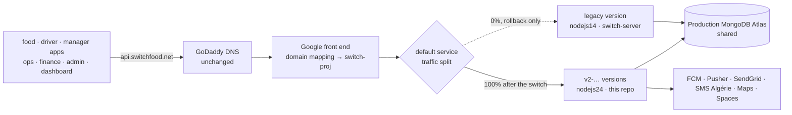

# Production: setup, CI/CD, the switch and rollback

Production is switch-proj's App Engine app, reached at **`https://api.switchfood.net`** by every
app and console. switch-server-v2 goes there as new versions of the app's `default` service,
next to legacy's version, and takes the traffic with one switch. Legacy stays deployed for a while
so the switch can be undone in seconds, then it is deleted.

This guide sets production up once (Part A, steps 1 to 9), makes the switch from legacy (Part B),
then covers rollback (Part C), everyday releases (Part D) and troubleshooting.

**The rules**

- Nothing reaches production except a **manual run from `main`** of `deploy-production` or
  `promote-production`. Google enforces it: the deploy identity is only issued to a manual run from
  `main` of this repository (step 7). A push or a merge deploys nothing.
- **A deploy never moves traffic.** It adds a version with no traffic. Moving traffic is a separate
  run of `promote-production`, one decision each time.
- **Never test against production.** No test accounts, synthetic orders, test pushes or
  cloud-function calls. The checks here are `/health` and logs only. Trying things is what staging
  is for ([05-staging.md](05-staging.md)).
- **Legacy's version is deleted by hand, once.** No workflow deletes it: it can never be deployed
  again.

---

## 1. How it works

### No DNS change

`api.switchfood.net` (DNS at GoDaddy) points at Google's App Engine front end:

| Record | Value | Change? |
|---|---|---|
| A | `216.239.32.21`, `216.239.34.21`, `216.239.36.21`, `216.239.38.21` | **No** |
| AAAA | `2001:4860:4802:32::15`, `…:34::15`, `…:36::15`, `…:38::15` | **No** |

These addresses are shared by every App Engine app in the world; there is no "v2 IP" to put
there. Google finds switch-proj's app from the domain mapping (`gcloud app domain-mappings list`),
and the app sends each request to whichever version of its `default` service has the traffic. So
**the switch is a traffic move inside switch-proj**: nothing changes at GoDaddy, in the domain
mapping or in the HTTPS certificate, and no app or console needs a new build.



### The pipeline

```mermaid
flowchart LR
  R["You: Run workflow<br/>deploy-production (main)"] --> CI["ci: typecheck · lint · format · tests · build · audit · gitleaks"]
  CI --> PF[preflight: .env.prod matches<br/>the project serving the domain] --> D["deploy dist/ as v2-N<br/>no traffic"] --> H["/health on v2-N's own URL"]
  H -. you decide .-> P["You: Run workflow<br/>promote-production (v2-N, 100 or 10)"]
  P --> W["wake v2-N, /health"] --> T[move the traffic] --> K[delete old v2 versions,<br/>keep the newest 3]
```



- `.github/workflows/deploy-production.yml` runs the same checks as every pull request, then
  deploys **the exact `dist/` they built and tested** with `--no-promote`. The version answers on
  its own URL (`https://v2-N-…-dot-<app host>`) and gets no production traffic.
- `.github/workflows/promote-production.yml` moves the traffic: 100% (the switch, a release, a
  rollback) or 10% / 50% (a canary, split by client IP). It never touches legacy's version except
  to give it traffic back.
- `tools/deploy/production-preflight.ts` refuses a deploy if `.env.prod` doesn't match the
  project: the project must serve `api.switchfood.net`, the pinned secret version must be enabled,
  and the public URL, client-IP header and Pusher ids must be set.
- Each version pins its own secret version (`SECRETS_VERSION`), so a rollback also rolls back
  secrets.

### What production uses

| Service | Production | Shared with legacy? |
|---|---|---|
| Hosting | App Engine, project `switch-proj`, service `default`, F2, 0–5 instances | same app and service, different versions |
| Database | production MongoDB Atlas cluster, database `switchDB` | **yes**, the same data |
| Push | Firebase project `switch-proj` (the apps' own) | yes |
| Realtime | the production Pusher app (key `b4cb8ea88897dba8ec3b`) | yes |
| Email · SMS · Distance | SendGrid · SMS Algérie · Google Maps | yes |
| Files | DigitalOcean Spaces, bucket `switchfood` | yes |
| Secrets | Secret Manager `switch-server-env` in switch-proj | no: legacy's are in `configs.js` |
| Config | `.env.prod` (committed, nothing secret) + `app.yaml` | no |
| Deploy identity | `github-deployer@switch-proj` through Workload Identity Federation | no |

### Legacy next to v2

- After the switch, legacy's version keeps **0% traffic** and stays deployed. Giving it the traffic
  back is one command (Part C).
- It **can't be stopped, only deleted.** App Engine only stops manual- or basic-scaling versions,
  and legacy's nodejs14 runtime can't be deployed any more. So deleting it is final.
- While it exists, it still runs:
  - **one instance** (its `min_instances: 1`);
  - **its dispatch worker.** It takes a share of the automatic-dispatch jobs, under legacy rules:
    no one-driver-per-order guarantee (D-20), and it repeats sends every round (D-21);
  - **its own API calls.** Legacy's cloud code calls `https://api.switchfood.net` with the master
    key, and after the switch that address is v2. So v2 keeps **legacy's master key**, and
    `MASTER_KEY_IPS` stays open, until legacy is deleted.
- Recommended: delete it after **7 clean days** at 100% v2, and never keep it past 30.

---

## 2. Before you start

| Who / what | Needed for |
|---|---|
| Google account with **Owner** on `switch-proj` (or App Engine Admin + Secret Manager Admin + IAM Admin + Workload Identity Pool Admin) | Part A |
| MongoDB Atlas project owner (production cluster) | step 3 |
| Pusher, SendGrid, DigitalOcean, Google Cloud console for Maps | step 5 |
| GitHub: admin of `switchdevv/switch-server-v2` | steps 7–8 |
| Legacy `switch-server/configs.js` (it holds today's production values) | step 5 |

Tools: Google Cloud CLI (`gcloud auth login`), GitHub CLI (`gh auth login`), Node 24 and pnpm,
`mongosh` (optional, step 9). Staging should already be set up and signed off
([05-staging.md](05-staging.md)).

Set these once per terminal, in `switch-server-v2/`. Every command below runs there and uses them.

```bash
cd switch-server-v2
export PROJECT_ID=switch-proj
export GITHUB_REPO=switchdevv/switch-server-v2
export REPO_ID=$(gh api "repos/$GITHUB_REPO" --jq .id)          # immutable, unlike the name
export PROJECT_NUMBER=$(gcloud projects describe "$PROJECT_ID" --format='value(projectNumber)')
export APPENGINE_SA="$PROJECT_ID@appspot.gserviceaccount.com"   # what App Engine runs as
export DEPLOY_SA="github-deployer@$PROJECT_ID.iam.gserviceaccount.com"
```

---

## Part A. One-time setup

Nothing in Part A changes what production serves. Steps 1 to 8 only read, or add things beside
legacy. Step 9 deploys v2 with no traffic.

### Step 1. Read what production runs today

Read-only:

```bash
gcloud app describe --project="$PROJECT_ID" \
  --format='table(locationId,defaultHostname,servingStatus,codeBucket)'
gcloud app services list --project="$PROJECT_ID"
gcloud app versions list --service=default --project="$PROJECT_ID" \
  --format='table(id,traffic_split,version.runtime,version.createTime)'
gcloud app domain-mappings list --project="$PROJECT_ID"
```

Expect one `default` service whose serving version has runtime `nodejs14` and traffic `1.0`, and
`api.switchfood.net` in the mappings. Keep:

```bash
export LEGACY_VERSION=<the nodejs14 version id at 1.0>
export CODE_BUCKET=$(gcloud app describe --project="$PROJECT_ID" --format='value(codeBucket)')
```

If more than one version shares the traffic, or the domain maps to another service, **stop**: this
guide assumes one legacy version at 100% of `default`.

### Step 2. APIs and the App Engine service account

Most are already on (legacy deploys through Cloud Build). Enabling one that is on is a no-op:

```bash
gcloud services enable appengine.googleapis.com cloudbuild.googleapis.com \
  artifactregistry.googleapis.com secretmanager.googleapis.com iam.googleapis.com \
  iamcredentials.googleapis.com sts.googleapis.com monitoring.googleapis.com \
  --project="$PROJECT_ID"
```

App Engine builds and runs every version, legacy's too, as `$APPENGINE_SA`. Check it has
`roles/editor`, as in staging step 1:

```bash
gcloud projects get-iam-policy "$PROJECT_ID" --flatten='bindings[].members' \
  --filter="bindings.members:serviceAccount:$APPENGINE_SA" --format='value(bindings.role)'
```

### Step 3. MongoDB Atlas

In the Atlas UI, on the production cluster:

1. **Version.** Parse 9 needs **MongoDB 7.0.16 or later** (plan §6.12). If the cluster is older,
   **stop**. An upgrade is a change of its own, and legacy's MongoDB driver (3.5) has to be checked
   against the new version first, on a restored copy (plan Phase 5).
2. **Backups.** Cloud Backup on, with point-in-time restore if the tier allows. Write down the
   snapshot schedule. An on-demand snapshot is taken again before the switch (Part B).
3. **Network access.** Nothing to add: v2 runs in the same App Engine app as legacy, so its
   traffic leaves from the same addresses.
4. **A database user for v2** (recommended): Database Access → Add new database user
   `switch-server-v2`, password *Autogenerate* (letters and digits only), **Specific privileges →
   `readWrite` on `switchDB`**. That is enough for Parse (indexes, change streams) and dispatch.
   With its own user, v2 keeps working when legacy's user (whose password is in `configs.js`) is
   deleted at decommission.
5. The connection string, with the database name after the host:

```text
mongodb+srv://switch-server-v2:PASSWORD@<cluster host>/switchDB?retryWrites=true&w=majority
```

### Step 4. Fill in `.env.prod`

`.env.prod` is production's non-secret config, committed and reviewed like code. Most of it
mirrors legacy's `configs.js` already. Check or set:

| Line | Value |
|---|---|
| `PARSE_PUBLIC_SERVER_URL` | `https://api.switchfood.net`. Don't change it: email links and file URLs are built from it. |
| `SECRETS_PROJECT` | `switch-proj` |
| `PUSHER_APP_ID`, `PUSHER_KEY` | Pusher → Channels → the app whose key is **`b4cb8ea88897dba8ec3b`** (the one switch-ops and the driver app subscribe with) → App Keys. The preflight refuses them blank. If no app has that key, stop and find out which one the driver app uses. |
| `DISPATCH_WORKER_ENABLED` | `false` for the switch. Legacy's worker runs the jobs until the T+24 h step. |
| `MASTER_KEY_IPS` | leave `0.0.0.0/0,::/0` while legacy exists (section 1, "Legacy next to v2") |
| `CLIENT_IP_HEADER` | leave `x-appengine-user-ip` |
| `SMS_RETRIEVER_HASH_*` | the production (Play-signed) hashes: leave |
| `DB_MAX_POOL_SIZE`, `DB_MAX_TIME_MS` | optional: `switch-ops/docs/backend-performance.md` |

Check what is still missing (read-only):

```bash
pnpm production:preflight --project "$PROJECT_ID"
```

At this point it should only complain about `SECRETS_VERSION`.

### Step 5. Secret Manager

All production secrets live in one Secret Manager secret, `switch-server-env`, as JSON. The server
reads the version pinned in `.env.prod` at boot. Create it, and let App Engine read it and nothing
else:

```bash
gcloud secrets create switch-server-env --replication-policy=automatic --project="$PROJECT_ID"
gcloud secrets add-iam-policy-binding switch-server-env --project="$PROJECT_ID" \
  --member="serviceAccount:$APPENGINE_SA" --role=roles/secretmanager.secretAccessor
```

**A push key for v2** (recommended). v2 needs a Firebase service-account key for FCM.
Rather than reuse legacy's (it is in `configs.js`), give v2 its own account with only the FCM
role. It must be *Firebase Cloud Messaging **API** Admin*, not the look-alike *Firebase Cloud
Messaging Admin*, which can't send:

```bash
gcloud iam service-accounts create switch-server-push --project="$PROJECT_ID" \
  --display-name="switch-server-v2 push (FCM)"
gcloud projects add-iam-policy-binding "$PROJECT_ID" --condition=None \
  --member="serviceAccount:switch-server-push@$PROJECT_ID.iam.gserviceaccount.com" \
  --role=roles/firebasecloudmessaging.admin
gcloud iam service-accounts keys create ~/switch-server-push.json \
  --iam-account="switch-server-push@$PROJECT_ID.iam.gserviceaccount.com"
```

(If an organization policy forbids keys: Firebase console → Project settings → Service accounts →
Generate new private key.)

Then add the first version:

```bash
pnpm production:secret
```

It asks for each value the drivers in `.env.prod` need. Secrets are typed hidden and only ever go
to `gcloud` on its standard input:

| Asked | Where to find it |
|---|---|
| `PARSE_MASTER_KEY` | **legacy's**: `configs.js` → `parse.masterKey`. It must be the same (section 1): the tool refuses any other. |
| `PARSE_MAINTENANCE_KEY` | not asked: generated |
| `DATABASE_URI` | step 3 |
| `SENDGRID_API_KEY` | `configs.js` → `sendgrid.apiKey`, or better a new key (SendGrid → Settings → API Keys → Restricted, *Mail Send* only) |
| `FIREBASE_SERVICE_ACCOUNT` | the path of `~/switch-server-push.json` |
| `PUSHER_SECRET` | Pusher → the app of step 4 → App Keys → `secret` |
| `SMS_API_KEY`, `SMS_USER_KEY` | `configs.js` → `sms.apiKey`, `sms.userKey` |
| `GOOGLE_MAPS_API_KEY` | `configs.js` → `google.mapKey`, or a new key restricted to the Distance Matrix API |
| `S3_ACCESS_KEY_ID`, `S3_SECRET_ACCESS_KEY` | `configs.js` → `spaces.s3overrides.accessKeyId`, `.secretAccessKey`, or a new Spaces key limited to `switchfood` |

Before anything is sent, it runs the server's own boot checks (every value valid, the database
named). It also checks that every identity in the version is **production's own**: the
production cluster, legacy's master key, the `switch-proj` Firebase project, the `switchfood`
bucket and the `api.switchfood.net` URL. So a staging value can't end up in production. It then
shows a summary without values. On `y` it adds the version and writes `SECRETS_VERSION=N` into
`.env.prod`.

```bash
rm ~/switch-server-push.json
pnpm production:preflight --project "$PROJECT_ID"   # now: no problem left
```

Commit `.env.prod` (it holds no secret; the ci checks that).

### Step 6. Monitoring and alerts

In the Google Cloud console, project `switch-proj`, Monitoring:

1. **Alerting → Edit notification channels → Email**: the on-call addresses (and SMS if you use it).
2. **Uptime checks → Create**: protocol HTTPS, host `api.switchfood.net`, path `/health`, check
   every 1 minute, response content contains `"status":"ok"`. Alert when it fails from 2 regions
   for 2 minutes, to the channel above.
3. **Alerting → Create policy**, one per line, each to the channel above:

| Alert | Condition |
|---|---|
| Server errors | 5xx share of `default` above **1% for 5 min**. In the PromQL editor (or the same ratio built in the UI): `sum(rate(appengine_googleapis_com:http_server_response_count{monitored_resource="gae_app",module_id="default",response_code=~"5.."}[5m])) / sum(rate(appengine_googleapis_com:http_server_response_count{monitored_resource="gae_app",module_id="default"}[5m])) > 0.01` |
| Slow | `App Engine › http/server/response_latencies`, 95th percentile, service `default`, above **1.5× legacy's p95** (read it in Metrics Explorer for the week before the switch) for 10 min |
| Memory | `App Engine › system/memory/usage`, service `default`, above **600 MB** (80% of F2's 768 MB) for 10 min |
| Function failures | a log-based metric (Logging → Log-based metrics → Counter) on `resource.type="gae_app" AND jsonPayload.msg="cloud function failed"`, labelled by `jsonPayload.fn`. Alert when it jumps above its usual rate. |
| Dispatch failures | log-based metric on `jsonPayload.msg=("dispatch job failed" OR "dispatch scan failed")`, alert on any |

4. Billing → Budgets & alerts: a monthly budget on `switch-proj` with alerts at 50/90/100%.

### Step 7. Deploy identity (Workload Identity Federation)

GitHub holds no Google key. A service account for GitHub, which Google only lets **a manual run
from `main` of this repository** use. The condition pins the repository by id, so a deleted and
re-created repository with the same name gets nothing:

```bash
# The pool, once per project (switch-ops/finance/admin reuse it). Skip if it exists:
#   gcloud iam workload-identity-pools describe github --location=global --project="$PROJECT_ID"
gcloud iam workload-identity-pools create github --project="$PROJECT_ID" \
  --location=global --display-name="GitHub Actions (production)"

gcloud iam workload-identity-pools providers create-oidc switch-server-v2 \
  --project="$PROJECT_ID" --location=global --workload-identity-pool=github \
  --display-name="switch-server-v2" --issuer-uri="https://token.actions.githubusercontent.com" \
  --attribute-mapping="google.subject=assertion.sub,attribute.repository=assertion.repository,attribute.repository_id=assertion.repository_id,attribute.ref=assertion.ref,attribute.event_name=assertion.event_name" \
  --attribute-condition="assertion.repository_id == '$REPO_ID' && assertion.ref == 'refs/heads/main' && assertion.event_name == 'workflow_dispatch'"

gcloud iam service-accounts create github-deployer --project="$PROJECT_ID" \
  --display-name="GitHub deploys (switch-server-v2, production)"
gcloud iam service-accounts add-iam-policy-binding "$DEPLOY_SA" --project="$PROJECT_ID" \
  --role=roles/iam.workloadIdentityUser \
  --member="principalSet://iam.googleapis.com/projects/$PROJECT_NUMBER/locations/global/workloadIdentityPools/github/attribute.repository_id/$REPO_ID"
```

What it may do: deploy versions, move traffic and delete versions without traffic; read the app
(including its domain mappings, for the preflight); run the build; act as the App Engine account;
see (not read) the secret's versions. It can't change the domain, certificates, firewall or app
settings, and can't read a secret:

```bash
for role in roles/appengine.deployer roles/appengine.serviceAdmin roles/appengine.appViewer \
  roles/cloudbuild.builds.editor roles/artifactregistry.reader; do
  gcloud projects add-iam-policy-binding "$PROJECT_ID" --condition=None \
    --member="serviceAccount:$DEPLOY_SA" --role="$role"
done
gcloud storage buckets add-iam-policy-binding "gs://$CODE_BUCKET" \
  --member="serviceAccount:$DEPLOY_SA" --role=roles/storage.objectAdmin
gcloud iam service-accounts add-iam-policy-binding "$APPENGINE_SA" --project="$PROJECT_ID" \
  --member="serviceAccount:$DEPLOY_SA" --role=roles/iam.serviceAccountUser
gcloud secrets add-iam-policy-binding switch-server-env --project="$PROJECT_ID" \
  --member="serviceAccount:$DEPLOY_SA" --role=roles/secretmanager.viewer
```

Storage is granted on the app's code bucket only (step 1), not on every bucket of the project.

### Step 8. GitHub repository variables

```bash
gh variable set PROD_GCP_PROJECT_ID --repo "$GITHUB_REPO" --body "$PROJECT_ID"
gh variable set PROD_GCP_DEPLOY_SA --repo "$GITHUB_REPO" --body "$DEPLOY_SA"
gh variable set PROD_GCP_WIF_PROVIDER --repo "$GITHUB_REPO" \
  --body "projects/$PROJECT_NUMBER/locations/global/workloadIdentityPools/github/providers/switch-server-v2"
```

Variables, not secrets: none of them grants anything without the federation of step 7. They sit
beside staging's `GCP_*` variables and never mix with them.

GitHub Free can't protect `main` on a private repository, so anyone with write access can push
to it. What stops a push from reaching production is step 7: only a manual run gets credentials.
With GitHub Pro, also add a branch protection rule on `main` (pull request required, no force
push).

### Step 9. First deploy, no traffic

v2's first boot on the production database may build indexes Parse 9 wants (plan §6.2, P5-1).
Do it in a quiet hour, and record the index list before and after (read-only). Use Atlas → Data
Explorer, or:

```bash
mongosh "<connection string of step 3>" --quiet --eval \
  'db.getCollectionNames().sort().forEach(c => print(c, JSON.stringify(db.getCollection(c).getIndexes().map(i => i.name))))' \
  > indexes-before.txt
```

Merge what staging signed off into `main` (a pull request from `stg`), then:

```bash
gh workflow run deploy-production --repo "$GITHUB_REPO" --ref main
gh run watch --repo "$GITHUB_REPO"
```

The first run takes about 10 minutes. When it is green, the run's summary shows the version
(`v2-N-1-abc1234`), its URL, `Dispatch worker: off` and what serves production (still legacy).
Check:

```bash
gcloud app versions list --service=default --project="$PROJECT_ID" \
  --format='table(id,traffic_split,version.runtime)'       # v2-… at 0, legacy at 1
gcloud app logs read --service=default --version=<v2-N-…> --project="$PROJECT_ID" --limit=50
```

The boot log must show no error. Then list the indexes again (`indexes-after.txt`) and `diff` the
two files. Every new index must be one you expected from the rehearsal. If there is anything else,
stop and decide before the switch.

---

## Part B. The switch

A single move of all traffic from legacy's version to v2, in seconds. Undoing it is the same
move back (Part C).

### Go / no-go

| Check | |
|---|---|
| Staging acceptance checklist signed off, per client (plan Appendix A) | ☐ |
| Rehearsal on a restored copy done, index plan approved (plan Phase 5), or knowingly skipped | ☐ |
| Step 9 green: v2 version healthy with no traffic, boot log clean, index diff understood | ☐ |
| `.env.prod`: `DISPATCH_WORKER_ENABLED=false` in the version you promote | ☐ |
| Alerts of step 6 live, dashboards open | ☐ |
| Atlas on-demand snapshot taken in the last hour | ☐ |
| A quiet hour chosen (Algiers time, fewest orders: read it from the order history) | ☐ |
| You and a second person available for the next 2 hours | ☐ |
| Ops team told: work normally, report anything odd at once. No console releases today | ☐ |
| `LEGACY_VERSION` and `V2_VERSION` written down | ☐ |

### T-0: move the traffic

Actions → **promote-production** → Run workflow on `main`, version `$V2_VERSION`, percent `100`:

```bash
export V2_VERSION=<v2-N-…>
gh workflow run promote-production --repo "$GITHUB_REPO" --ref main \
  -f version="$V2_VERSION" -f percent=100
gh run watch --repo "$GITHUB_REPO"
```

It wakes v2 (the version has no instance until then), checks `/health`, then moves the traffic
with `--migrate`, so App Engine warms instances before they take requests. Legacy's version
keeps running at 0%.

Optional, more careful: `percent=10` first. v2 gets 10% of clients, by IP, and legacy the rest.
Watch for an hour or more, then run it again with `100`.

### Verify, first 5 minutes

```bash
gcloud app services describe default --project="$PROJECT_ID" --format='value(split.allocations)'
# → v2-N-…=1.0

MARK=$(openssl rand -hex 6)
curl -s "https://api.switchfood.net/health?switch=$MARK"; echo
gcloud logging read --project="$PROJECT_ID" --freshness=10m --limit=1 \
  "resource.type=\"gae_app\" AND resource.labels.version_id=\"$V2_VERSION\" AND protoPayload.resource:\"$MARK\"" \
  --format='value(protoPayload.resource)'
# → /health?switch=<MARK>: the domain now reaches v2
```

Then Logs Explorer, both versions side by side:

```text
resource.type="gae_app" AND resource.labels.module_id="default" AND severity>=WARNING
```

### First hour: gates

| Watch | Healthy | Roll back if |
|---|---|---|
| 5xx share (step 6 alert) | under 1% | above 1% for 5 min |
| `cloud function failed` by `fn` | the usual few | a function failing that didn't on legacy, or failing for everyone |
| Sign-in, OTP SMS, placing an order (ops and support reports; `verifyPhone`, `placeOrder` in the logs) | as before | any of them broken |
| Pushes (`newOrder send failed`, customers' status pushes) | as before | missing |
| p95 latency and memory (step 6) | within the alerts | alerts firing and not settling |

**When in doubt, roll back first (Part C, seconds) and investigate after.** Rolling back loses
nothing: data v2 wrote is readable by legacy (plan §6.11).

### T+24 h: switch the dispatch worker on

Until now, legacy's still-running version has executed every automatic-dispatch job, while v2 has
only been enqueueing them. Once the first day is clean:

1. In `.env.prod` set `DISPATCH_WORKER_ENABLED=true`. Pull request into `stg`, then into `main`.
2. Run **deploy-production** (the summary says `Dispatch worker: on`), then **promote-production**
   with that version at `100`.
3. Watch `dispatch job failed` / `dispatch scan failed` (step 6) stay at zero, and the next
   deliveries a restaurant accepts in the manager app get drivers as before.

Both workers now share the jobs until legacy is deleted.

### T+7 days: delete legacy

Once 7 days have passed without a rollback, and ops have nothing open about the new server:

```bash
gcloud app versions delete "$LEGACY_VERSION" --service=default --project="$PROJECT_ID"
```

**This is final.** From now on, rollback means a previous v2 version (Part C). Deleting it also
ends legacy's dispatch worker and its calls through the API, so D-20 (one driver per order) and
D-21 (one send per driver) hold from here on.

### Decommission (plan Phase 7)

Within the following weeks:

1. **Rotate every secret that was in `configs.js`**, which is in git history. Before legacy was
   deleted this would have broken it; now nothing uses the old values:
   - master key: `pnpm production:secret --new-master-key` (the apps don't use it; tell whoever
     uses the Parse Dashboard);
   - the SendGrid, SMS, Maps and Spaces keys, and the Pusher secret, where step 5 reused legacy's:
     new ones, then revoke the old ones at each provider;
   - Atlas: delete legacy's database user `switch`, once nothing else connects with it;
   - Firebase: delete legacy's `firebase-adminsdk-…` key (IAM → Service accounts → Keys), once
     nothing else uses it.

   Each change is `pnpm production:secret`, commit, deploy, promote. Staging borrows some of these
   accounts (`SHARED_PROD_CREDENTIALS`), so update its secret too (`pnpm staging:secret`).
2. **Close the master key** (OD-6): set `MASTER_KEY_IPS` to the Parse Dashboard operators'
   addresses, deploy and promote. Then check it is refused from anywhere else, the same way as
   staging ([05-staging.md](05-staging.md), "Check the master key is closed").
3. Archive the legacy repository (read-only).

---

## Part C. Rollback

| Situation | Do | Takes |
|---|---|---|
| A new v2 release misbehaves | promote-production with the **previous v2 version** at `100` (its id is in the last promote run's summary, "Roll back") | seconds |
| v2 itself misbehaves after the switch, legacy still deployed | promote-production with **`$LEGACY_VERSION`** at `100` | seconds |
| Legacy already deleted | promote a previous v2 version, or deploy a fix and promote it | minutes |
| A canary (10%/50%) looks wrong | promote-production with the version that had the rest, at `100` | seconds |

Break-glass, when GitHub is down (an operator account with App Engine Admin):

```bash
gcloud app services set-traffic default --splits="<version>=1" --project="$PROJECT_ID"
```

After a rollback to legacy:

- What v2 added answers `141 Invalid function` again: the ops and finance Access switches (D-22),
  switch-admin's admin functions (D-24) and driver declines (D-23). The consoles show "needs the
  new server"; nothing is lost.
- The data stays compatible (plan §6.11): sessions, passwords, orders and files written by v2 work
  on legacy.
- If v2's dispatch worker was on, its instances stop once they are idle. Any job a v2 instance had
  locked is picked up by legacy after the 10-minute lock.
- Keep the v2 version for the investigation (the promote run deletes only v2 versions beyond the
  newest 3). Its logs stay in Logs Explorer.

---

## Part D. Everyday use

| Task | How |
|---|---|
| Release | Merge into `stg` and test on staging → pull request `stg` → `main` → **Run deploy-production** → **Run promote-production** (`10` first for a risky change, then `100`). |
| What is live | `gcloud app services describe default --project=switch-proj --format='value(split.allocations)'`, or the last promote run's summary. |
| Redeploy the same commit (e.g. after a secret change) | Run deploy-production again on `main`, then promote. |
| Change a secret | `pnpm production:secret` (Enter keeps a value) → commit `.env.prod` → pull request to `main` → deploy → promote. Older versions stay enabled for rollback; disable them in Secret Manager once the new one has run a few days. |
| Change a setting | Edit `.env.prod` (or `app.yaml` for scaling), same flow. `pnpm production:preflight --project switch-proj` checks it. |
| Logs | `gcloud app logs tail --service=default --project=switch-proj`, or Logs Explorer: `resource.type="gae_app" AND resource.labels.version_id="<version>"`. |
| A deploy that must not go out | Don't promote it. Delete it: `gcloud app versions delete <version> --service=default --project=switch-proj`. |
| Scaling | `app.yaml`. Only the version with most of the traffic keeps an idle instance (`min_idle_instances: 1`); versions without traffic scale to zero. `min_instances` would keep an instance, with a dispatch worker, on every old version. |

A change that also needs a client change ships on the server first (staging, then production), then
the client. switch-ops, switch-finance and switch-admin each have a `docs/production.md` with
their release order.

---

## Troubleshooting

| Symptom | Cause and fix |
|---|---|
| `Set these repository variables` | Step 8. |
| `Production deploys only from main` | Run the workflow on `main` (the Run workflow menu's branch). |
| auth: `unauthorized_client` / rejected by the attribute condition | Not a manual run from `main`, or `REPO_ID` in the provider condition isn't this repository's (step 7). A push-triggered or `stg` run can never get production credentials. |
| auth: `iam.serviceAccounts.getAccessToken` denied | The `workloadIdentityUser` binding of step 7. New bindings take a few minutes. |
| preflight: `api.switchfood.net is not mapped` | `PROD_GCP_PROJECT_ID` isn't `switch-proj`. |
| preflight: `can't list … domain mappings` | The deployer's `roles/appengine.appViewer` (step 7). |
| preflight: other errors | Each names the `.env.prod` line and the value; step 4 or 5. |
| `gcloud app deploy`: `storage.objects…` denied on a bucket | Step 7's grant is on `$CODE_BUCKET`; if the error names another bucket, grant `roles/storage.objectAdmin` on that one too. |
| deploy: permission denied, or Cloud Build fails at once | Deployer roles (step 7), the App Engine account's role (step 2), an API (step 2). |
| `never answered /health` | The version didn't boot; the error prints the log command. `Invalid environment`: a value in `.env.prod` or the secret. `Secrets must come from Secret Manager only`: a secret key pasted into `.env.prod` or `app.yaml`. `PERMISSION_DENIED` on the secret: step 5's accessor binding. MongoDB timeout: the URI or the user (step 3). |
| promote: `No version … in the default service` | A typo, or the version was deleted. `gcloud app versions list --service=default --project=switch-proj`. |
| promote: `Migration refused; moving at once` (warning) | App Engine wouldn't migrate gradually; the traffic moved at once to a version checked healthy. Nothing to do. |
| promote: `already has all the traffic` | A canary needs another version serving; use `100`. |
| promote: `set-traffic` refused at the switch, naming the deprecated runtime | App Engine won't move traffic away from, or back to, a nodejs14 version (plan risk RK-2). The call changes nothing, so production is still on legacy. Stop and resolve it with Google Cloud support before trying again. |
| After the switch, a legacy-only error in logs | Legacy's version is still running (instance, dispatch worker, its own calls into v2): expected until it is deleted. |
| Pushes stop | `FIREBASE_SERVICE_ACCOUNT` lacks *FCM **API** Admin* (step 5), or its key was deleted. Send errors are logged as `newOrder send failed`. |
| No OTP SMS / no email | `SMS_*` / `SENDGRID_API_KEY` in the secret (step 5); check the provider's dashboard. |
| ops don't see driver declines live | `PUSHER_APP_ID`/`PUSHER_KEY` (step 4) or `PUSHER_SECRET` (step 5) aren't the app ops subscribe to (`b4cb8ea88897dba8ec3b`). |

---

## Reference

**Identities**

| Account | Roles | Used by |
|---|---|---|
| `switch-proj@appspot.gserviceaccount.com` | Editor (project); Secret Accessor on `switch-server-env` | App Engine: every version at runtime and at build |
| `github-deployer@switch-proj` | App Engine Deployer, Service Admin, Viewer; Cloud Build Editor; Artifact Registry Reader (project); Storage Object Admin on the code bucket; Service Account User on the App Engine account; Secret Manager Viewer on `switch-server-env` | deploy-production, promote-production (WIF: manual run from `main` of this repository only) |
| `switch-server-push@switch-proj` | Firebase Cloud Messaging API Admin | v2's FCM sends (key inside the secret) |
| `github-hosting-deployer@switch-proj` | Firebase Hosting Admin | the consoles' deploy-production (their `docs/production.md`) |

**Files**

| File | What |
|---|---|
| `app.yaml` | runtime, instance class, scaling (`APP_ENV=production`) |
| `.env.prod` | non-secret config, including `SECRETS_VERSION` and `DISPATCH_WORKER_ENABLED` |
| `.github/workflows/deploy-production.yml` | ci → preflight → deploy with no traffic → `/health` |
| `.github/workflows/promote-production.yml` | wake → `/health` → move the traffic → delete old v2 versions |
| `tools/deploy/production-preflight.ts` | `pnpm production:preflight --project switch-proj` |
| `tools/secret.ts` | `pnpm production:secret` (and `pnpm staging:secret`) |
